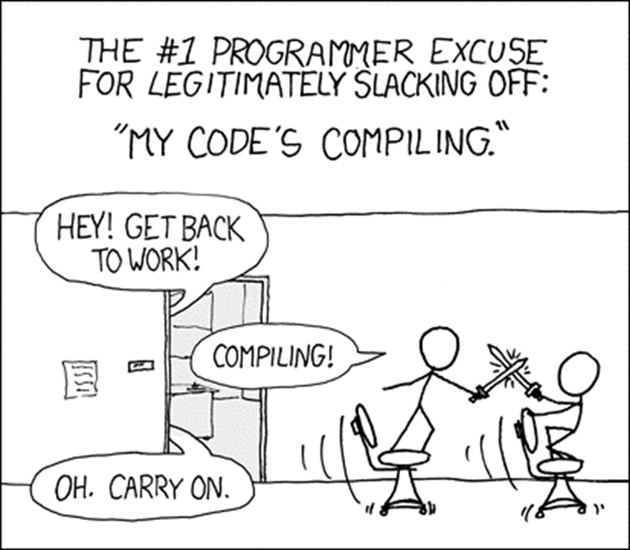
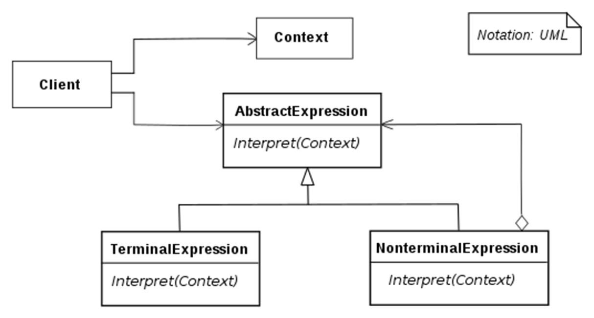
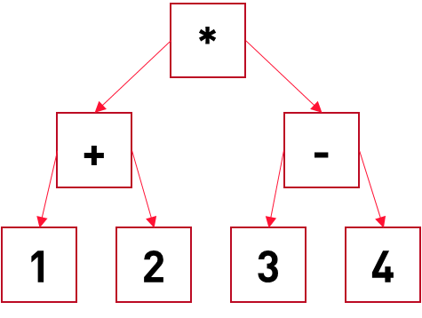
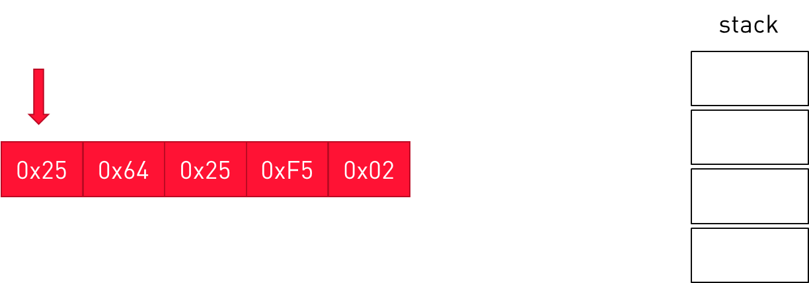
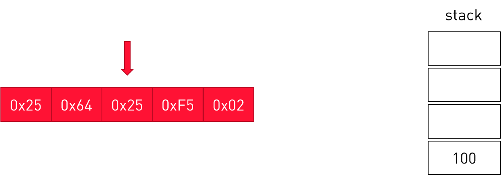
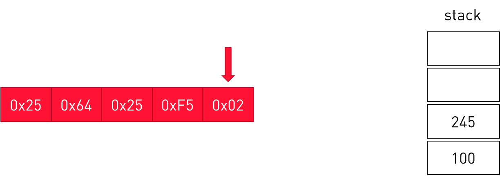

<!-- _class: title-slide-v2023 -->

# Byte code

<!-- footer: Programming 4 -->

---
<!-- header: Game programming patterns - Byte code -->
<!-- paginate: true -->

# Problem



How bad do you think it can be?

<sub>https://xkcd.com/303/</sub>

---

# Problem

<div class="columns"><div>

**Game Designers**
- Want to define behavior in the game
    - NPC’s
    - Items
    - Enemies
    - Spells
    - ...

- Are not programmers
- Want to iterate quickly

</div><div>

**Game Programmers**
- Want optimized code
- Want working code
- Don’t want anyone to meddle with their code.

</div></div>

---

# Solution

- Define behavior outside the code.
- Define behavior in separate data files.
- Load and run that behavior.
    - No compile times 
    - Fast iteration 
    - Hot reloading
    - No meddling in the code
    - ...

---

# Solution – how?

Interpreter pattern



---

# Interpreter pattern

Example
```(1 + 2) * (3 – 4)```

The literals are terminal expressions – they just return their value

The operators are compound expressions, they combine the results of the child nodes



This is not so good - why?
What is better?

<!--
Lots of small objects – fragmentation
Pointers all around – traversing is murder on the cache + uses a lot of mem.
-->

---

# Byte code

Machine code is better.
But we don’t want it to be complex (or you’d better switch to C++ again)

Byte code – from the book:
“An **instruction set** defines the low-level operations that can be performed. A series of instructions is encoded as a **sequence of bytes**. A **virtual machine** executes these instructions one at a time, using a **stack for intermediate values**. By combining instructions, complex high-level behavior can be defined.”

---

# VM

Say we have some methods in our game we want to expose

```cpp
void add_npc(int id);
void remove_npc(int id);
void set_health(int id, int amount);
int get_health(int id);
//...
```

We create an instruction set:

```cpp
enum class instruction
{
    add_npc = 0x00,
    remove_npc = 0x01,
    set_health = 0x02,
    get_health = 0x03,
    //...
    literal = 0x25,
    //..
};
```

<!--
Much like the mov, add, etc we have on CPU’s
-->

---

# VM

Executed by some VM we wrote ourselves:

```cpp
class virtual_machine {
public:
    void interpret(char bytecode[], int size)
    {
        for (int i = 0; i < size; i++) {
            char instruction = bytecode[i];
            switch (instruction)
            {
                case add_npc:
                    npc_manager::get_instance().add_npc(id);
                    break;
                case remove_npc:
                    npc_manager::get_instance().remove_npc(id);
                    break;
                case set_health:
                    npc_manager::get_instance().get_npc(id).set_health(health);
                    break;
                // etc ...
            }
        }
    }
};
```

---

# VM Stack

The VM maintains a stack:

```cpp
class virtual_machine {
private:
    static const int max_stack = 128;
    int stack_size;
    int stack_[max_stack];

    void push(int value)
    {
        stack_[stack_size++] = value;
    }

    int pop()
    {
        return stack_[--stack_size];
    }
};
```

---

# VM Stack

Pop the parameters from the stack:

```cpp
switch(instruction)
{
    // ...
    case set_health:
	    int id = pop();
	    int health = pop();
        npc_manager::get_instance().get_npc(id).set_health(health);
        break;
    // ...
}
```

Who pushes those values on the stack?

---

# VM Stack

The ```literal``` command:

```cpp
switch(instruction)
{
    // ...
    case literal:
        int value = bytecode[++i];
        push(value);
        break;
    // ...
}
```

---

# VM Stack

This is the bytecode for setting the health of npc 245 to 100:


---

# VM Stack

This is the bytecode for setting the health of npc 245 to 100:



```cpp
case literal:
    int value = bytecode[++i];
    push(value);
    break;
```

---

# VM Stack

This is the bytecode for setting the health of npc 245 to 100:



```cpp
case literal:
    int value = bytecode[++i];
    push(value);
    break;
```

---

# VM Stack

This is the bytecode for setting the health of npc 245 to 100:



```cpp
case set_health:
    int id = pop();
    int health = pop();
    npc_manager::get_instance().get_npc(id).set_health(health);
    break;
```

---

# VM

You get the picture.
- We need to add instructions for combining results, like add, subtract, compare, control flow (if then else), etc…
- And many more.
- How are other values than integers handled?

Considerations
- A designer does not want to create buffers of integers.
- You’ll need to provide some tool – can be a lot of work!
    - Can be graphical
    - Or text (like some scripting language)

---

# VM

Lots of engines provide some sort of VM and a scripting language

<center>

 <div style="width:400px">Engine</div>  | <div style="width:400px">Language</div>
------ | --------
Source | Lua
Unreal | UnrealScript
GameMaker | GML
Godot | GDScript
Lumberyard | Lua
CryEngine | Lua

</center>

---

# Exercise

Integrate Lua with C++

Write a program that can read and execute a given compiled Lua script
The script adds and removes a few NPCs

Write your own lua script that adds and removes some NPC's
Add a SetHealth function that takes an NPC name and new health value
Use that in your script.
Log the results in the Dump method of the NPCManager
