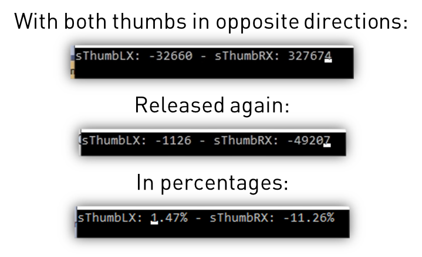
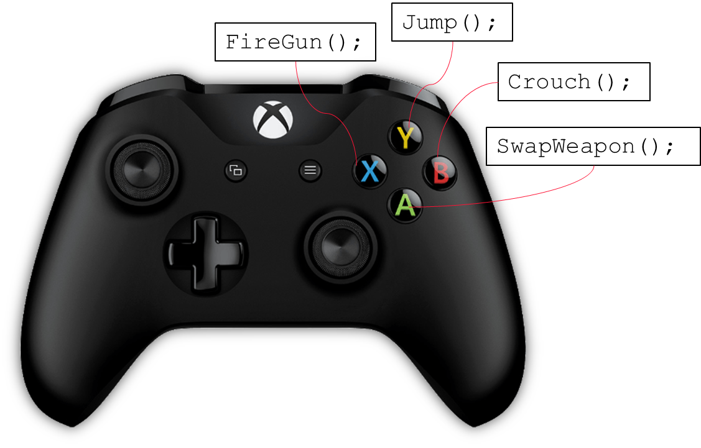
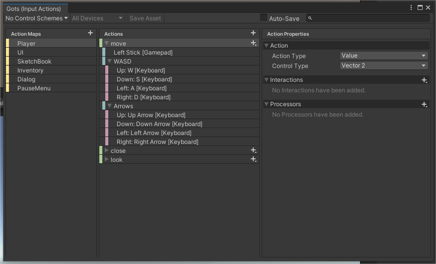
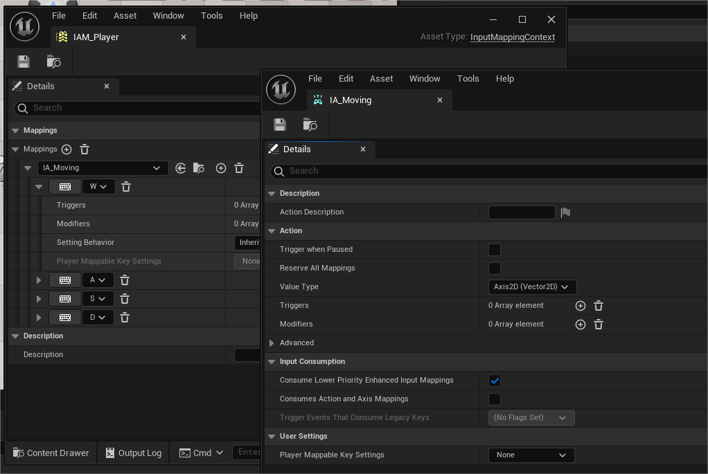

<!-- _class: title-slide-v2023 -->

# Command & Pimpl

<!-- footer: Programming 4 -->

---
<!-- header: Game programming patterns - Command -->
<!-- paginate: true -->
# Input

Remember we discussed the game loop

```cpp
bool do_continue = true;
while(do_continue)
{
  do_continue = process_input();
  update();
  render();
}
```

We discussed that ```update()```, ```render()``` is covered in Graphics Programming 1 & 2. 
Today we discuss ```process_input()```

---

# Input

Comes from all kinds of devices

- Digital buttons
  - Down or Up, 0 or 1, circuit is open or closed.
- Analog Axes/Buttons
  - Range of values
    - Thumb RX -32768 -> 32768 (Xbox)
    - Trigger R 0 -> 255 (Xbox)
- Relative Axis
  - No defined center point, so no range possible 
  - Delta position values (mouse for example)
- Accelerometers
  - Delta acceleration values (Wiimote, or VR controllers for example)
- Touch
  - Pressure ranges

---

# Input polling

One way to process input is via "polling"

- Periodically read the current state of the device
  - Periodically: once per frame in our example
- Often game pads, joysticks
- On windows, this is what the XInput API provides
  - ```XInputGetState()```

```cpp
XINPUT_STATE state;
ZeroMemory(&state, sizeof(XINPUT_STATE));
DWORD dwResult = XInputGetState(i, &state);
```

---

# XInput

<div class="columns"><div>

```cpp
typedef struct XINPUT_STATE {  
    DWORD dwPacketNumber;  
    XINPUT_GAMEPAD Gamepad;  
} XINPUT_STATE
```

```cpp
typedef struct XINPUT_GAMEPAD {  
    WORD wButtons;  
    BYTE bLeftTrigger;  
    BYTE bRightTrigger;  
    SHORT sThumbLX;  
    SHORT sThumbLY;  
    SHORT sThumbRX;  
    SHORT sThumbRY;  
} XINPUT_GAMEPAD
```

</div><div>

wButtons is a word with byteflags for each button.


</div></div>

---

# XInput

Check for example if Gamepad button A is pressed:

```cpp
bool IsButtonAPressed(const XINPUT_GAMEPAD& gamepad) 
{
  return ((gamepad.wButtons & XINPUT_GAMEPAD_A) != 0);
}
```

Better, somewhere during ```process_input()```:

```cpp
CopyMemory(&previousState, &currentState, sizeof(XINPUT_STATE));
ZeroMemory(&currentState, sizeof(XINPUT_STATE));
XInputGetState(m_controllerIndex, &currentState);

auto buttonChanges = currentState.Gamepad.wButtons ^ previousState.Gamepad.wButtons;
buttonsPressedThisFrame = buttonChanges & currentState.Gamepad.wButtons;
buttonsReleasedThisFrame = buttonChanges & (~currentState.Gamepad.wButtons);
```

---

# XInput

Which enables us to implement the following:

```cpp
bool IsDownThisFrame(unsigned int button) const
{
  return buttonsPressedThisFrame & button;
}

bool IsUpThisFrame(unsigned int button) const
{
  return buttonsReleasedThisFrame & button;
}

bool IsPressed(unsigned int button) const
{
  return currentState.Gamepad.wButtons & button;
}

```

---

# XInput

```cpp
CopyMemory(&previousState, &currentState, sizeof(XINPUT_STATE));
ZeroMemory(&currentState, sizeof(XINPUT_STATE));
XInputGetState(m_controllerIndex, &currentState);
```

<div class="columns"><div>

Which buttons do we check here?

```cpp
(currentState.Gamepad.wButtons & 16) == 16
(currentState.Gamepad.wButtons & 68) == 68
```

Say 

```currentState.Gamepad.wButtons``` is ```0b00010100```

Which of  the two return true?

</div><div>


</div></div>

<!-- 
First: 16 == 0x0010, so start button
Second: 68 == 0x0044 so dpad left and left thumb
The second one is false, only the first comparison is true
-->

---

# XInput

```cpp
auto buttonChanges = currentState.Gamepad.wButtons ^ previousState.Gamepad.wButtons;
buttonsPressedThisFrame = buttonChanges & currentState.Gamepad.wButtons;
buttonsReleasedThisFrame = buttonChanges & (~currentState.Gamepad.wButtons);
```

<div class="columns"><div>

Say

```previousState.Gamepad.wButtons``` is ```0b00010000```
```currentState.Gamepad.wButtons``` is ```0b00010100```

What is ```buttonChanges```?
What is ```buttonsPressedThisFrame```?
What is ```buttonsReleasedThisFrame```?

Say 

```previousState.Gamepad.wButtons``` is ```0b00010001``` instead

What is ```buttonsReleasedThisFrame``` now?

</div><div>


</div></div>

<!-- 
XOR operator, so buttonChanges is 0b0000’0100 – it is the dpad left that now has been pressed

buttonsPressedThisFrame is 0b0000’0100
buttonsReleasedThisFrame is 0b0000’0000 want 0b0000’0100 & 0b1110’1011

2nd case
buttonsReleasedThisFrame is 0b0000’0001 want 0b0000’0101 & 0b1110’1011
-->

---

# XInput

Why the hassle? So that instead of

```cpp
bool IsDownThisFrame(unsigned int button) const
{
  return ((currentState.Gamepad.wButtons & button) != 0) &&
    ((previousState.Gamepad.wButtons & button) == 0);
}
```

We can now write

```cpp
bool IsDownThisFrame(unsigned int button) const
{
  return buttonsPressedThisFrame & button;
}
```

---

# XInput

<div class="columns"><div>

```cpp
typedef struct XINPUT_STATE {  
    DWORD dwPacketNumber;  
    XINPUT_GAMEPAD Gamepad;  
} XINPUT_STATE
```

```cpp
typedef struct XINPUT_GAMEPAD {  
    WORD wButtons;  
    BYTE bLeftTrigger;  
    BYTE bRightTrigger;  
    SHORT sThumbLX;  
    SHORT sThumbLY;  
    SHORT sThumbRX;  
    SHORT sThumbRY;  
} XINPUT_GAMEPAD
```

</div><div>

A byte for the triggers (8-bit unsigned)
- [0 – 255]

A short for the thumbsticks (16bit signed)
- [-32768 – 32767]

Take deadzones into account!

</div></div>

---

# Deadzones you say?

<div style="font-size: 28px;">

```cpp
#define WIN32_LEAN_AND_MEAN
#include <windows.h>
#include <XInput.h>
#include <iostream>
#include <thread>

#pragma comment(lib, "xinput.lib")

int main()
{
    XINPUT_STATE currentState{};
    int controllerIndex{};

    while (true)
    {
        auto t = std::chrono::high_resolution_clock::now();
        
        ZeroMemory(&currentState, sizeof(XINPUT_STATE));
        XInputGetState(controllerIndex, &currentState);

        std::cout << "\rsThumbLX: " << currentState.Gamepad.sThumbLX 
          << " - sThumbRX: " << currentState.Gamepad.sThumbRX;

        if (currentState.Gamepad.wButtons & XINPUT_GAMEPAD_B)
            break;

        auto t2 = std::chrono::high_resolution_clock::now() - t;
        t += std::chrono::milliseconds(16) - t2; // we want ~60 fps
        std::this_thread::sleep_until(t);
    }
}
```

</div>



---

# Input via interrupts

Interrupts – IRQ
- When state of a device changes (p.ex. a mouse has moved) an interrupt request signal is sent to the CPU
- Main program is halted shortly, input data is processed (ISR), main continues and can work with the received data.
- When we process input, we process the received interrupts since the last frame one by one

```cpp
// Main message loop:
while (GetMessage(&msg, nullptr, 0, 0)) {
    if (!TranslateAccelerator(msg.hwnd, hAccelTable, &msg)) {
        TranslateMessage(&msg);
        DispatchMessage(&msg);
    }
}
```

<!-- 
ISR - Interrupt service routine
Default message loop of a windows desktop application. GetMessage is blocking until a message is received
-->

---

# Input via interrupts

Interrupts – IRQ
- When state of a device changes (p.ex. a mouse has moved) an interrupt request signal is sent to the CPU
- Main program is halted shortly, input data is processed (ISR), main continues and can work with the received data.
- When we process input, we process the received interrupts since the last frame one by one

```cpp
bool dae::InputManager::ProcessInput() {
  SDL_Event e;
  while (SDL_PollEvent(&e)) {
    if (e.type == SDL_QUIT) {
      return false;
    } else if (e.type == SDL_KEYDOWN) {
      
    } elseif (e.type == SDL_MOUSEBUTTONDOWN) {
      
    }
    // etc...
  }
  return true;
}
```

<!-- = loop of SDL – non blocking -->

---

# Input

Wireless input devices
- Often via Bluetooth
- Need a separate thread to receive the data send by the device over the network
- And to send data back to the device (like sound and rumble data)
- Often abstracted away behind an API Layer.

---

# Problem statement



```cpp
if(is_pressed(BUTTON_Y))
  Jump();
else if (is_pressed(BUTTON_X))
  Firegun();
else if (is_pressed(BUTTON_A))
  SwapWeapon();
else if (is_pressed(BUTTON_B))
  Crouch();
```

What's wrong with this code?
How can we improve it?

<!-- 
What are the problems with this piece of code?
Better to use a switch – correct, but irrelevant 
What if we want the user to configure the mapping?
Could use function pointers/functors/lambda’s
-->

---

# Command

```cpp
class Command
{
  public:
   virtual ~Command() = default;
   virtual void Execute() = 0;
}

class Jump : public Command
{
  public:
    void Execute() override { Jump(); }
}

class Fire : public Command
{
  public:
    void Execute() override { Fire(); }
}
```

<!-- Looks a lot like a functor, which could be a valid implementation! -->

---

# Command

Even better:

```cpp
class GameActorCommand : public Command 
{
  GameActor* m_actor;
protected:
  GameActor* GetGameActor() const { return m_actor; }
public:
  GameActorCommand(GameActor* actor);
  virtual ~GameActorCommand();
}

class Fire : public GameActorCommand {
public:
  void Execute() override 
  { 
    GetGameActor()->Fire();

    // additional code is possible too, of course 
  }
}
```

---

# Command

These commands need to be registered with the Input manager
  - The input manager keeps track of all active commands
  - Checks if the input for the command has been executed by the user
  - Calls the Execute method on the registered command
  - Don't forget to unregister!

Mapping the input to the commands is up to you.

---

# Actions in Unity



---

# Actions in Unreal



---

# Actions

Actions is the mapping of some input to an ID. This id then gets mapped to a certain command or function.

```cpp
if (auto EnhancedInputComponent = Cast<UEnhancedInputComponent>(InputComponent))
{
  EnhancedInputComponent->BindAction(MoveAction, ETriggerEvent::Triggered, this, 
    &AMyPlayerController::OnMove);
}
```

---

# Command

Editors (not games) often (always?) work with stacked commands, to enable Undo/Redo functionality.

```cpp
class EditorCommand : public Command
{
  public:
   virtual ~EditorCommand() = default;
   virtual void Undo() = 0;
}
```

This is how virtually all commands in software works... Of course, in-game actions don't often need an Undo, so make a distinction!

---

<!-- header: Game programming patterns - Pimpl -->

# Pimpl

Is a C++ pattern/idiom
> Remove compilation dependencies on internal class implementations and improve compile times

Item #43 from C++ Coding Standards by Herb Sutter: “Pimpl judiciously”

Advantages
- Faster compilation times
  - (easier project setup too)
- Avoids ambiguity

<sub>https://cpppatterns.com/patterns/pimpl.html</sub>

---

# Example

The Renderer - we want to dynamically choose between DirectX and OpenGL - do you see the problem?

<div class="columns"><div>

Renderer.h:

```cpp
class Renderer abstract
{
public: 
    virtual void RenderTriangles(
      float* verts, int* indices) = 0;
};
```

OpenGLRenderer.h:

```cpp
#include "Renderer.h"
#include <SDL.h>

class OpenGLRenderer : public Renderer
{
public:
    void RenderTriangles(
      float* verts, int* indices) override;
private:
    SDL_Texture* m_pRenderTexture;
};
```

</div><div>

DirectXRenderer.h:

```cpp
#include "Renderer.h"
#include <d3d11.h>

class DirectXRenderer : public Renderer
{
public:
    void RenderTriangles(
      float* verts, int* indices) override;
private:
    ID3D11Texture2D* m_pRenderTexture;
};
```
</div></div>

---

# Example

Let's apply Pimpl.

<div class="columns"><div>

OpenGLRenderer.h:

```cpp
#include "Renderer.h"

class OpenGLRenderer : public Renderer
{
    class OpenGLRendererImpl;
    OpenGLRendererImpl* m_pImpl;
public:
    void RenderTriangles(
      float* verts, int* indices) override;
};
```

</div><div>

OpenGLRenderer.cpp:

```cpp
#include "OpenGLRenderer.h"
#include <SDL.h>

class OpenGLRenderer::OpenGLRendererImpl
{
    SDL_Texture* m_pRenderTexture;
  public:
    void DoRenderTriangles(
      float* verts, int* indices);
};

void OpenGLRenderer::OpenGLRendererImpl::
  DoRenderTriangles(float* verts, int* indices) {
    // the actual implementation
  }

void OpenGLRenderer::RenderTriangles(
  float* verts, int* indices) {
    m_pImpl->DoRenderTriangles(verts, indices);
}
```

</div></div>
