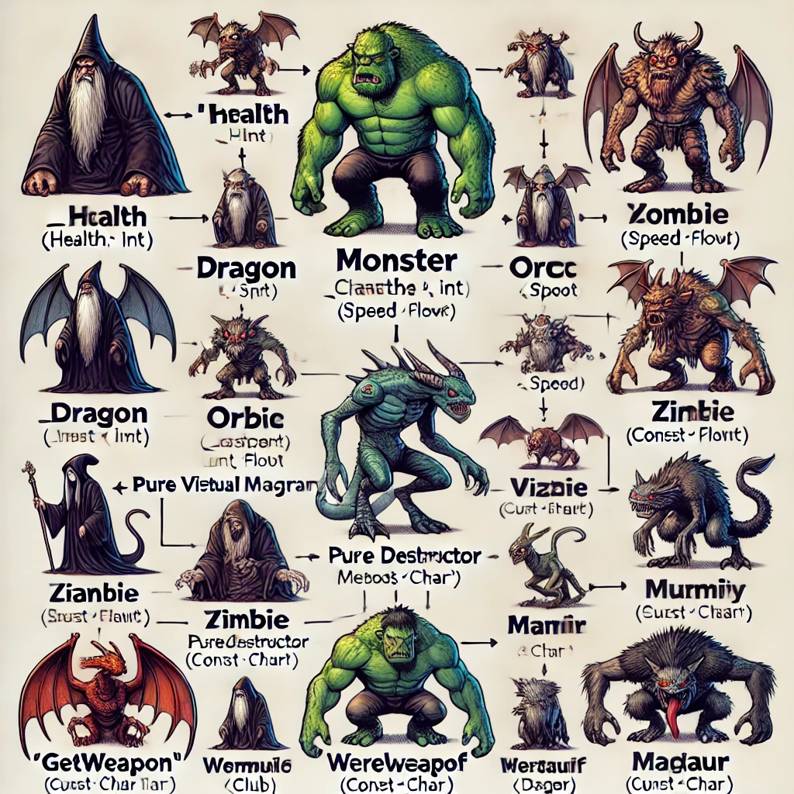

<!-- _class: title-slide-v2023 -->

# Flyweights, Prototypes and Type Objects

---
<!-- header: Inheritance FTW -->
<!-- paginate: true -->

# There must be monsters

Quick! Write me a MMORPG with hundreds of monsters, spawning from various caves, pits, nests and whatnot!

*Sure thing boss, I've got a degree in DAE:\**

```cpp
class Monster
{
    int _health;
    float _speed;

    //... lots of other data

public:
    Monster(int health, float speed);
    virtual ~Monster() = default;

    virtual const char* GetWeapon() = 0;

    //... lots of other methods
};
```

<sub>*or a 3rd year student in their internship</sub>

<!-- footer: Programming 4  - Flyweights, Prototypes and Type Objects -->

---

# There be monsters

<div class="columns"><div>

```cpp
class Troll : public Monster
{
public:
    Troll() : Monster(50, 2) {}

    virtual const char* GetWeapon() override {
        return "Club";
    }
};
```

```cpp
class Dragon : public Monster
{
public:
    Dragon() : Monster(200, 20) {}

    virtual const char* GetWeapon() override {
        return "FireBreathing";
    }
};
```

</div><div>

```cpp
class Goblin : public Monster
{
public:
    Goblin() : Monster(30, 3) {}

    virtual const char* GetWeapon() override {
        return "Dagger";
    }
};
```

```cpp
class Orc : public Monster
{
public:
    Orc() : Monster(100, 5) {}

    virtual const char* GetWeapon() override {
        return "Axe";
    }
};
```

</div></div>

---

# There be monsters

<div class="columns"><div>

```cpp
class Vampire : public Monster
{
public:
    Vampire() : Monster(80, 4) {}

    virtual const char* GetWeapon() override {
        return "Bite";
    }
};
```

```cpp
class Zombie : public Monster
{
public:
    Zombie() : Monster(60, 1) {}

    virtual const char* GetWeapon() override {
        return "Claws";
    }
};
```

</div><div>

```cpp
class Wizard : public Monster
{
public:
    Wizard() : Monster(50, 8) {}

    virtual const char* GetWeapon() override {
        return "Magic";
    }
};
```

```cpp
class Giant : public Monster
{
public:
    Giant() : Monster(300, 2) {}

    virtual const char* GetWeapon() override {
        return "Rock Throwing";
    }
};
```

</div></div>

---

# There be monsters

<div class="columns"><div>

```cpp
class Phoenix : public Monster
{
public:
    Phoenix() : Monster(150, 6) {}

    virtual const char* GetWeapon() override {
        return "Fireball";
    }
};
```
```cpp
class Werewolf : public Monster
{
public:
    Werewolf() : Monster(90, 7) {}

    virtual const char* GetWeapon() override {
        return "Claws and Fangs";
    }
};
```

</div><div>

```cpp
class Mummy : public Monster
{
public:
    Mummy() : Monster(120, 2) {}

    virtual const char* GetWeapon() override {
        return "Wrapped Curse";
    }
};
```

```cpp
class Centaur : public Monster
{
public:
    Centaur() : Monster(80, 6) {}

    virtual const char* GetWeapon() override {
        return "Bow and Arrow";
    }
};
```

</div></div>

Etcetera, etcetera,... (hundreds!)

---

# There be monsters

I asked ChatGPT for an UML diagram but...



---

# There be classes

You catch my drift: lots of lots of lots of classes.

And then the game designers start to yap: "The dragons are too strong can you half their health", or "The vampires weapon should be Fangs not Bite", ...

So your life is now:

- Get email from the designer asking for a change
- Check out the file and make the change
- Recompile the game, run tests
- Submit the change
- Reply the email
- Repeat.

Very contrived example of course, but what is the main issue and how do we solve it? 
- (hint: the designers stay alive)

<!-- 
- Inheritance and composition is better. But out of what do we compose? Not components again... 
- Also: we should be data driven
-->

--- 

# There must be spawning

We're not done yet, we needed to spawn them too!

Easy peasy lemon sqeezy:

```cpp
class Spawner
{
public:
    virtual ~Spawner() = default;
    virtual Monster* SpawnMonster() = 0;

    //... some additional code calling the SpawnMonster function in due time
};
```

<!-- an interface, start of the Factory Method pattern -->

---

# There be spawners

<div class="columns"><div>

```cpp
class TrollSpawner : public Spawner
{
public:
    virtual Monster* SpawnMonster() override
    {
        return new Troll();
    }
};
```

```cpp
class DragonSpawner : public Spawner
{
public:
    virtual Monster* SpawnMonster() override
    {
        return new Dragon();
    }
};
```

</div><div>

```cpp
class GoblinSpawner : public Spawner
{
public:
    virtual Monster* SpawnMonster() override
    {
        return new Goblin();
    }
};
```

```cpp
class OrcSpawner : public Spawner
{
public:
    virtual Monster* SpawnMonster() override
    {
        return new Orc();
    }
};
```

</div></div>

---

# There be spawners

<div class="columns"><div>

```cpp
class VampireSpawner : public Spawner
{
public:
    virtual Monster* SpawnMonster() override
    {
        return new Vampire();
    }
};
```

```cpp
class ZombieSpawner : public Spawner
{
public:
    virtual Monster* SpawnMonster() override
    {
        return new Zombie();
    }
};
```

</div><div>

```cpp
class WizardSpawner : public Spawner
{
public:
    virtual Monster* SpawnMonster() override
    {
        return new Wizard();
    }
};
```

```cpp
class GiantSpawner : public Spawner
{
public:
    virtual Monster* SpawnMonster() override
    {
        return new Giant();
    }
};
```

</div></div>

---

# There be spawners

<div class="columns"><div>

```cpp
class PhoenixSpawner : public Spawner
{
public:
    virtual Monster* SpawnMonster() override
    {
        return new Phoenix();
    }
};
```

```cpp
class WerewolfSpawner : public Spawner
{
public:
    virtual Monster* SpawnMonster() override
    {
        return new Werewolf();
    }
};
```

</div><div>

```cpp
class MummySpawner : public Spawner
{
public:
    virtual Monster* SpawnMonster() override
    {
        return new Mummy();
    }
};
```

```cpp
class CentaurSpawner : public Spawner
{
public:
    virtual Monster* SpawnMonster() override
    {
        return new Centaur();
    }
};
```

</div></div>

Hundreds! - You're laughing but this is students' code

---

# Easy peasy lemon sqeezy

Just use templates! Obviously!

<div class="columns"><div>

```cpp
template <typename T>
class Spawner final
{
public:
    static_assert(std::is_base_of<Monster,T>::value, 
        "T must derive from Monster");

    Monster* SpawnMonster()
    {
        return new T();
    }
};
```

</div><div>

```cpp
using TrollSpawner = Spawner<Troll>;
using DragonSpawner = Spawner<Dragon>;
using GoblinSpawner = Spawner<Goblin>;
using OrcSpawner = Spawner<Orc>;
using VampireSpawner = Spawner<Vampire>;
using ZombieSpawner = Spawner<Zombie>;
using WizardSpawner = Spawner<Wizard>;
using GiantSpawner = Spawner<Giant>;
using PhoenixSpawner = Spawner<Phoenix>;
using WerewolfSpawner = Spawner<Werewolf>;
using MummySpawner = Spawner<Mummy>;
using CentaurSpawner = Spawner<Centaur>;
//...
```

</div></div>

Yes, but in what issue do we run again?

<!-- this is all defined at compile time, we need it at run time, aka data driven -->

---

<!-- header: Composition FTW -->

# Enter composition

Add components?

<!-- No, composition is not only components -->

---

# Type Object

> Allow the flexible creation of new "classes" by creating a class, each instance of which represents a different type of object.

Instead of having a class for each new breed of monster, we say a monster **has a** breed.


- No inheritance
- 2 classes

> Define a **type object** class and a **typed object** class. Each type object instance represents a different logical type. Each typed object stores a **reference to the type object that describes its type**.

---

# Type Object

<div class="columns"><div>

```cpp
class Breed
{
    int _health;
    float _speed;
    const char* _weapon;
public:
    Breed(const char* weapon, int health, 
        float speed) : _weapon(weapon), 
        _health(health), _speed(speed) {}

    int GetHealth() const { return _health; }    
    float GetSpeed() const { return _speed; }
    const char* GetWeapon() const { 
        return _weapon; 
    }
};
```

</div><div>

```cpp
class Monster
{
    int _health;
    Breed& _breed;

public:
    Monster(Breed& breed) :
    _health(breed.GetHealth()), _breed(breed) {}

    const char* GetWeapon() const { 
        return _breed.GetWeapon(); 
    }

    //... lots of other methods
};
```

</div></div>

<!-- Notice how these two classes cover all the previous code -->

---

# Type Object

Making type objects more like types: "constructors"

<div class="columns"><div>

```cpp
class Breed
{
    int _health;
    float _speed;
    const char* _weapon;
public:
    Breed(const char* weapon, int health, 
        float speed) : _weapon(weapon), 
        _health(health), _speed(speed) {}

    Monster* CreateMonster() { 
        return new Monster(*this); 
    }

    int GetHealth() const { return _health; }    
    float GetSpeed() const { return _speed; }
    const char* GetWeapon() const { 
        return _weapon; 
    }
};
```

</div><div>

```cpp
class Monster
{
    friend class Breed;
    int _health;
    Breed& _breed;

    Monster(Breed& breed) :
    _health(breed.GetHealth()), _breed(breed) {}

public:
    const char* GetWeapon() const { 
        return _breed.GetWeapon(); 
    }

    //... lots of other methods
};
```

</div></div>

<!-- Here we just return a new object, but we could add a lot of other initialization here => this is a factory method after all. -->

---

# Type Object considerations

Use it when:

- At compile time it's impossible to know what types there are going to be.
- You want to change types at runtime (add/edit/remove)

But:

- You need to maintain your own type system now, creating them, loading them into memory, unloading them when they're no longer required, etc
- How will you define behaviour for each type? Suggestions?

Can the type change at runtime?
- Could be useful for an object pool of monsters

Do we support inheritance?
- A breed could refer to a parent breed
  - To create Orc Zombies for example


<!-- Behaviour can via id's to some sort behaviour/ai like "patrolling" or something. Better: byte code pattern -> lua 

Changing types enabled object pools, just swap the breed, but that has a lot of other implications

Without inheritance we might be copy-pasting a lot of data.
-->

---

# Still need that spawning

Template version no longer works

```cpp
using TrollSpawner = Spawner<Troll>;
//...
```

How then?

---

# Still need that spawning

Template version no longer works

```cpp
using TrollSpawner = Spawner<Troll>;
//...
```

Yes, **composition**, via the *prototype pattern*. 

> Specify the kinds of objects to create using a prototypical instance, and create new objects by copying this prototype.

---

# Prototype

We add a clone function to the ``Monster`` and use that in the ``Spawner``:

<div class="columns"><div>

```cpp
class Spawner final
{
    Monster* _prototype;
public:
    Spawner(Monster* prototype) : 
        _prototype(prototype) {}

    Monster* SpawnMonster()
    {
        return _prototype->Clone();
    }
};
```

</div><div>

```cpp
class Monster
{
    friend class Breed;
    int _health;
    Breed& _breed;

    Monster(Breed& breed) :
    _health(breed.GetHealth()), _breed(breed) {}

public:
    const char* GetWeapon() const { 
        return _breed.GetWeapon(); 
    }

    Monster* Clone()
    {
        auto result = new Monster(_breed)
        result->_health = _health;
        return result;
    }

    //... lots of other methods
};
```

</div></div>

---

# Cloneable

Often happens via an interface (exists by default in .Net and Java)

```cpp
class ICloneable
{
public:
    virtual ~ICloneable() = default;
    virtual ICloneable* Clone() = 0;
}
```

But why a Clone function? Why not simply use the copy constructor?

<!-- The copy constructor is not virtual, we need to know the type of what we copy. -->

---

# More data

Let's forget the ``Breed`` class for a moment and have a look at that "lots of other data"

```cpp
class Monster
{
    int _health;
    float _speed;

    Mesh _mesh;
    Shader _shader;
    Texture2D _albedo;
    Texture2D _normal;
    Color _albedoColor;
    Color _teamColor;
    Transform _transform;
    
    //... still lots of other data, like animations, sound, and whatnot.

public:
    Monster(int health, float speed);
    virtual ~Monster() = default;

    virtual const char* GetWeapon() = 0;
};
```

<!-- 
Having this data copied for every monster is obviously not the best idea
- lots of mem
- doesn't fit in cacheline anymore
Components again?
-->

---

# Composition FTW

Components? Perhaps, or:

<div class="columns"><div>

```cpp
class MonsterModel
{
    Mesh _mesh;
    Shader _shader;
    Texture2D _albedo;
    Texture2D _normal;
    Color _albedoColor;
}
```

</div><div>


```cpp
class Monster
{
    int _health;
    float _speed;

    MonsterModel* _model;
    Color _teamColor;
    Transform _transform;

public:
    Monster(int health, float speed);
    virtual ~Monster() = default;

    virtual const char* GetWeapon() = 0;
};
```

</div></div>

One set of model data can now be used by all Monsters of the same type.

---

# Flyweight

> Use sharing to support large numbers of fine-grained objects efficiently

The ``MonsterModel`` contains the shared data of the monsters that look the same.

- This data is often **immutable**.
- This data is called the **intrinsic** state of the instance.
- The other data, unique to the instance, is the **extrinsic** state.

## Considerations

<!-- In the book, it's called "context-free" instead of intrinsic.-->

- What popular example do you know of this pattern?

<!-- Instanced rendering -->

- If we put everything together, a ``Monster`` now has a ``Breed`` and a ``MonsterModel`` - can we combine these?

<!-- Yes and no, it's a design choice. The intent between the two is different. -->

- Both the **Flyweight** and **Type Object** pattern go well together with **Object Pool**.