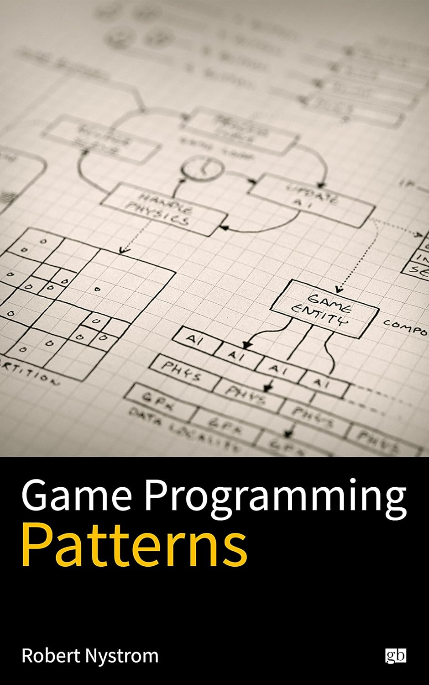
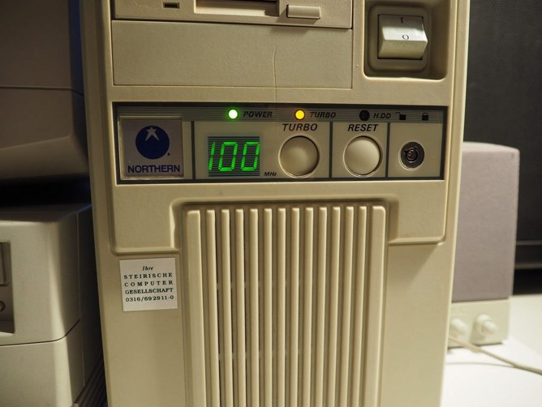
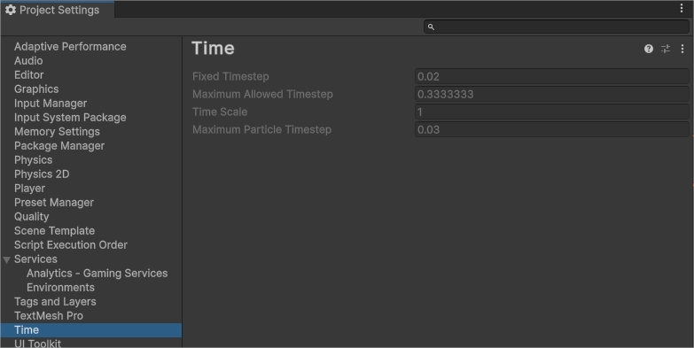
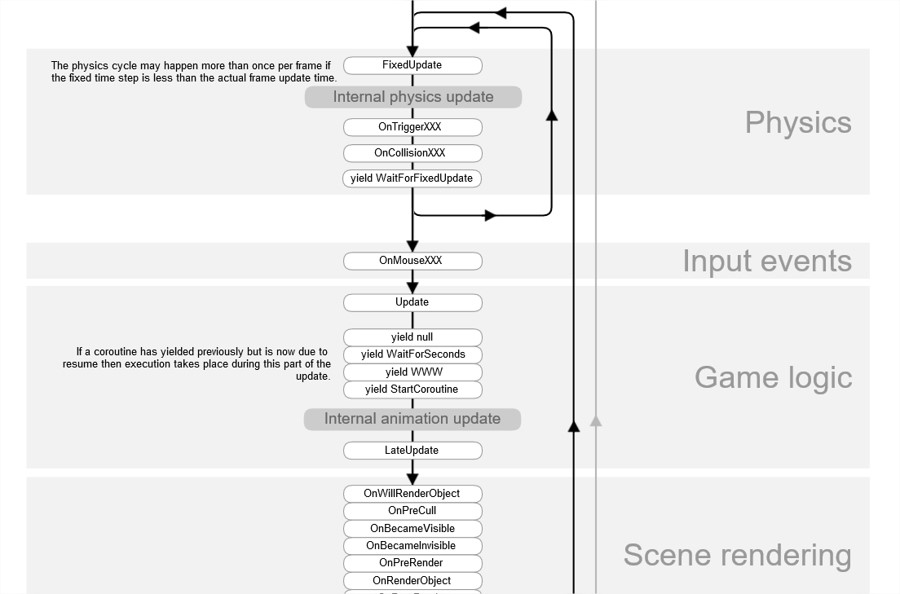
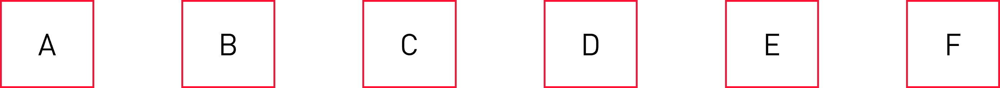
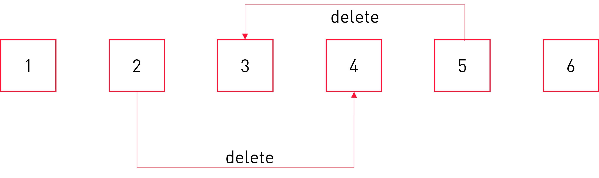
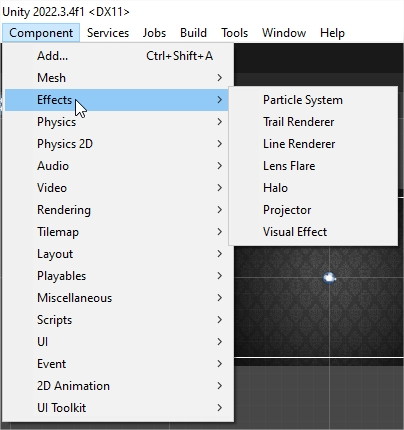
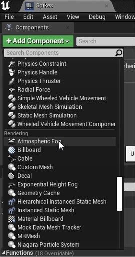

<!-- _class: title-slide-v2023 -->

# Gameloop, Update method & Component

<!-- footer: Programming 4 -->

---
<!-- header: Software design patterns -->
<!-- paginate: true -->

# Software design what patterns?

- Software design patterns are **blueprints** of **possible** solutions to **common** problems
- They are hints to how you can solve a particular problem
- They're only that, they're no law
- Different contexts call for different solutions
- Language agnostic

---

# Gang of four


---

# Game Programming Patterns



- More recent and applied to game programming
- Notice "programming" patterns
- Written by Robert Nystrom
  - Software engineer @ Google
  - Lead software engineer @ EA
      - Superman returns
      - Madden NFL
      - NASCAR
  - https://journal.stuffwithstuff.com

- http://gameprogrammingpatterns.com

---

<!-- header: Game programming patterns - Game loop -->

# Game loop

```cpp
int APIENTRY wWinMain(_In_ HINSTANCE hInstance,
                      _In_opt_ HINSTANCE hPrevInstance,
                      _In_ LPWSTR    lpCmdLine,
                      _In_ int       nCmdShow)
{
    UNREFERENCED_PARAMETER(hPrevInstance);
    UNREFERENCED_PARAMETER(lpCmdLine);
    LoadStringW(hInstance, IDS_APP_TITLE, szTitle, MAX_LOADSTRING);
    LoadStringW(hInstance, IDC_TESTTEMP, szWindowClass, MAX_LOADSTRING);
    MyRegisterClass(hInstance);
    if (!InitInstance (hInstance, nCmdShow)) {
        return FALSE;
    }
    HACCEL hAccelTable = LoadAccelerators(hInstance, MAKEINTRESOURCE(IDC_TESTTEMP));
    MSG msg;

    while (GetMessage(&msg, nullptr, 0, 0)) {
        if (!TranslateAccelerator(msg.hwnd, hAccelTable, &msg)) {
            TranslateMessage(&msg);
            DispatchMessage(&msg);
        }
    }
    return (int) msg.wParam;
}
```

<!-- default windows c++ desktop application looks like this -->

---

# Game loop

Probably the simplest or most obvious pattern there is, yet it's tricky to get it right.

```cpp
while(true)
{
  processInput();
  update();
  render();
}
```

What are we missing here?

<!-- What’s so special: most programs don’t need this and wait for user input before doing something. But with games, something is happening all the time even without input. This makes this first pattern unique (almost) to games.

We need to exit somehow
-->

---

# Game loop

Indeed we need to exit somehow:

```cpp
bool do_continue = true;
while(do_continue)
{
  do_continue = process_input();
  update();
  render();
}
```
---

# Turbo speed!



<!-- In "the olden days" when computers were slow enough, this loop was enough. The hardware could not go very fast, so updating, displaying and doing it again meant that you were rendering at 15 fps.
Ironically - that's why there was a turbo button on old pc's: they were too fast for some games so then you could switch the turbo off and the game would run fine.

Today, computers run a lot faster and - more important - run multiple programs at the time. You need to leave some cpu breathing space so other programs on your pc get a chance + if you utilize the pc all the time running at 240 fps you're wasting power (aka batteries in a mobile context)

Games run just fine at 60 fps, 90 fps for VR
-->

---

# Don't go too fast

```cpp
bool do_continue = true;
while (do_continue)
{
  const auto start = high_resolution_clock::now();
  
  do_continue = process_input();
  update();
  render();
  
  const auto sleep_time = start + milliseconds(ms_per_frame) - high_resolution_clock::now();

  this_thread::sleep_for(sleep_time);
}
```

What else goes wrong here?

<!-- 
But often the game can’t keep that pace and you’ll run slower than 60 fps, making your game appearing slower.
-->

---

# Adapt to the actual time

```cpp
bool do_continue = true;
auto last_time = high_resolution_clock::now();
while (doContinue)
{
  const auto current_time = high_resolution_clock::now();
  const float delta_time = duration<float>(current_time – last_time).count();
  last_time = current_time;

  do_continue = process_input();
  update(delta_time);
  render();

  const auto sleep_time = current_time + milliseconds(ms_per_frame) - high_resolution_clock::now();

  this_thread::sleep_for(sleep_time);
}
```
<!-- Instead of waiting, measure the actual time that has passed each frame and adjust your simulation to that value. 

Slower PC’s will take bigger steps each frame, but at least you’ll advance at the same speed.
Faster PC’s will render more often which is what you want.

If VSYNC is enabled the Render call will cap to the refresh rate of the screen.

But: different players will have different rounding errors – problem in multiplayer games
Rounding errors (and certainly small values) are VERY bad for the physics engine and networking.
-->

---

# Catch up in fixed steps

```cpp
bool do_continue = true;
auto last_time = high_resolution_clock::now();
float lag = 0.0f;
while (doContinue)
{
  const auto current_time = high_resolution_clock::now();
  const float delta_time = duration<float>(current_time – last_time).count();
  last_time = current_time;
  lag += deltaTime;
  
  do_continue = process_input();
  while(lag >= fixed_time_step)
  {
    fixed_update(fixed_time_step);
    lag -= fixed_time_step;
  }
  update(delta_time);
  render();

  const auto sleep_time = current_time + milliseconds(ms_per_frame) - high_resolution_clock::now();

  this_thread::sleep_for(sleep_time);
}
```

<!-- We still adapt to the actual time, but we do it in fixed steps. That way the rounding errors will be less and multiplayer is sure to be in sync.

fixed_time_step -> too long, gameplay will be choppy. Too short, there won’t be enough time and you’ll never catch up.
-->

---

# Fixed time step

- That ```fixed_time_step```, how much should it be?
- It should be a config setting, every game has different requirements




- Important: the fixed update is only relevant for **physics and networking**

---



<sub>https://docs.unity3d.com/Manual/ExecutionOrder.html</sub>

<!-- Unity does something similar, they do the fixed time step thingy in the FixedUpdate, but the Update is called once per frame, just like the LateUpdate -->

---

<!-- header: Game programming patterns - Update method -->

# Update method

- The game maintains a collection of objects (often called "game objects" or "actors")
- Every frame the **update** method is called on those objects.

```cpp
void scene::update()
{
  for (auto object : m_objects)
  {
    object->update();
  }
}
```

---

# Update method

<div class="columns"><div>

You need to split code and keep some state around

```cpp
while(true) {
  int i = 0;
  // move right
  for(; i < 100; ++i) skeleton.set_x(i);
  // move left
  for(; i >= 0; --i) skeleton.set_x(i);
}
```

</div><div>

That simple code becomes now

```cpp
int i = 0;
bool is_walking_left = false;

void update()
{
  if(is_walking_left) 
  {
    i--;
    if(i == 0) is_walking_left = false
  }
  else 
  {
    i++;
    if(i == 100) is_walking_left = true;
  }
  skeleton.set_x(i);
}
```

</div></div>

The state pattern comes into view here

---

# Update method

That is one of the advantages of coroutines in Unity

```cs
private IEnumerator DoPatrol()
{
  float direction = 1.0f;
  while(true)
  {
    for(int i = 0; i < 100; ++i) 
    {
      skeleton.transform.position += direction * Vector3.right;
      yield return null;
    }
    direction = -direction;
  }
}
```

<sub>https://docs.unity3d.com/Manual/Coroutines.html</sub>

<!--With coroutines you can actually get the best of both worlds.
Most of the time it’s even better to use coroutines than the update method.
Don’t know Coroutines? Maybe later. -->

---

# Update order?

Be aware of interdependencies
- If object A comes before B in the update list.
- When A updates it sees B’s old state
- But when B updates it sees A’s new state




Example: If object C is the camera and object E is the player...

Solution?
  - Double Buffer pattern
  - LateUpdate method

---

# Deleting objects

What happens when one object removes another in its Update?



- Don’t remove them until all have been updated, but “mark” as dead.
- Delete them after all updates have been finished.

---

# Delta time?

Do we pass the deltaTime to the Update method? (as we have seen in the game loop pattern)

```cpp
void update(float delta_time)
{
  if(is_walking_left) {
    i--;
    if(i == 0) is_walking_left = false
  }
  else {
    i++;
    if(i == 100) is_walking_left = true;
  }
  skeleton.set_x(i * delta_time);
}
```

This is the approach chosen by Unreal

```cpp
void SomeActor::Tick(float DeltaTime)
{
  Super::Tick(DeltaTime);
  // code
}
```

<!-- this is an application of so-called dependency injection -->

---

# Delta time?

You could use a singleton, as for example happens in Unity:

```cs
private IEnumerator DoPatrol()
{
  float direction = 1.0f;
  while(true)
  {
    for(int i = 0; i < 100; ++i) 
    {
      skeleton.transform.position += direction * Vector3.right * Time.deltaTime;
      yield return null;
    }
    direction = -direction;
  }
}
```

Advantage? You can use it in other places than the Update method as well (as in the above example).
<sub>Note: I wrote singleton with a lower case s</sub>

<!--Ideal moment for a break here.-->

--- 

# Update method

On what objects do we call this Update method?

```cpp
namespace dae
{
  class Texture2D;
  class GameObject 
  {
    Transform m_transform{};
    std::shared_ptr<Texture2D> m_texture{};
  public:
    virtual void Update();
    virtual void Render() const;

    void SetTexture(const std::string& filename);
    void SetPosition(float x, float y);

    GameObject() = default;
    virtual ~GameObject();
    GameObject(const GameObject& other) = delete;
    GameObject(GameObject&& other) = delete;
    GameObject& operator=(const GameObject& other) = delete;
    GameObject& operator=(GameObject&& other) = delete;
  };
}
```

<!-- The GameObect class in Minigin has the Update method and gets called by the scene.
Elaborate on responsibilities here – should the gameobject hold the render data? What about animations? What about sound? What about AI? Do we subclass? Do we make a Guard/Skeleton/Hero/Animal/… class?
-->

---

<!-- header: Game programming patterns - Component -->

# Prefer composition over inheritance

<center style="font-size: 120px;">
<b>Prefer<br>
composition<br>
over<br>
inheritance</b>
</center>

---

# Prefer composition over inheritance

<center style="font-size: 120px;">
<b>Prefer composition<br>
over inheritance</b>
</center>

---

# Prefer composition over inheritance

<center style="font-size: 120px;">
<b>Composition<br>
should be preferred<br>
over inheritance</b>
</center>

---

# Component

Prefer composition over inheritance. (Item 34 in "C++ coding standards" by Herb Sutter)

- The game world exists of “GameObjects”.
- Every game object has several components that govern an aspect of the Gameobject
  - RenderComponent does the rendering
  - AudioComponent plays the audio
  - PhysicsComponent takes care of the physics
  - ...
- Redirect the update method to the components.

---

# Inheritance

Wait, inheritance is bad?
NO
Obviously not, we’ll be using a lot of inheritance while implementing the component pattern.

Choose the right tool for the right job. 
Don’t use a swiss knife to hammer in a nail.

Inherit, not to reuse, but to be reused. (Item 37 in "C++ coding standards")

---

# Components in Unity



Unity is a state-of-the-art example

Several Components
- MeshRenderer
- RigidBody
- AudioSource
- Camera
- NavMeshAgent
- ...

Create your own by inheriting from MonoBehaviour

---

# Component communication

- Via common state in the GameObject
  - Hard to tell what that data should be, if the components are unknown.
  - Order in which the components are updated becomes relevant
  - ```Component.transform```

- Get the component you want to talk to from the GameObject
  - Simple and fast
  - Tightly coupled
  - ```GameObject.GetComponent<T>```

- Sending messages to the GameObject
  - All components receive it.
  - ```GameObject.SendMessage```

---

# Components in Unreal



In Unreal we have this too:
- AActor is the game object class
- UActorComponent is the base component class

Several Components
- UCameraComponent
- UParticleSystemComponent
- UStaticMeshComponent
- ...

To get the component you want to talk to from the actor:

```cpp
auto component = 
  Cast<T>(GetOwner()->GetComponentByClass(T::StaticClass()));
```
Lots of common state
- ```USceneComponent* RootComponent```

