<!-- _class: title-slide-v2023 -->

# Memory management

<!-- footer: Programming 4 -->

---
<!-- header: Memory management -->
<!-- paginate: true -->

# Why?

- Trash the cache: hardware memory management
- This week: application memory management
    - Brace yourselves
- We skipped: operating system memory management

---

# Why?

Memory management in its essence is
- Allocating memory (as fast as possible)
- Deallocating that same memory (as fast as possible)

Acquire heap memory with ``malloc`` or ``new``
Free heap memory with ``free`` or ``delete``

- Why do we bother with memory management?
- Why is it that in game software we find memory management important?

<!-- 
Limited ram sizes on consoles. (on pc we have a virtual heap so we have unlimited memory size, however it still comes at a cost)
Fragmentation – games have a game loop, executing lots of code all the time, other programs are usually event based.
Allocation and deallocation are costly operations
Locality of reference
-->

---

# Fragmentation

Fragman-what-now?

Say this is the memory being managed by a *first fit allocator*:


---

# Fragmentation

Fragman-what-now?

Let's allocate some memory:


---

# Fragmentation

Fragman-what-now?

Let's allocate some more objects:


---

# Fragmentation

Fragman-what-now?

Now we release some memory:


---

# Fragmentation

Fragman-what-now?

And we allocate and release some more, see the problem growing:


Why is it that games are often affected by this?

<!-- 
Potentially a lot of objects are being allocated/deallocated each frame, that's why we need to be smart about it. Easiest is of course not to allocate anything :)
-->

---

# Fragmentation

This is even valid for HDD's!

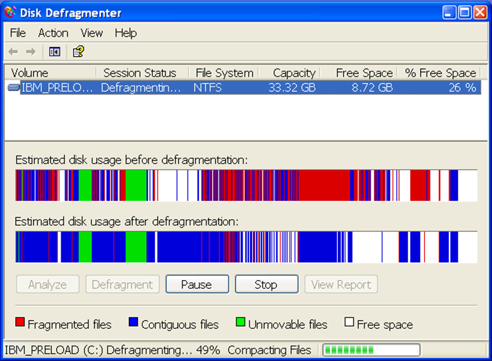

How are games affected by this on disk?

---

# Memory segments

A program consists of several memory segments

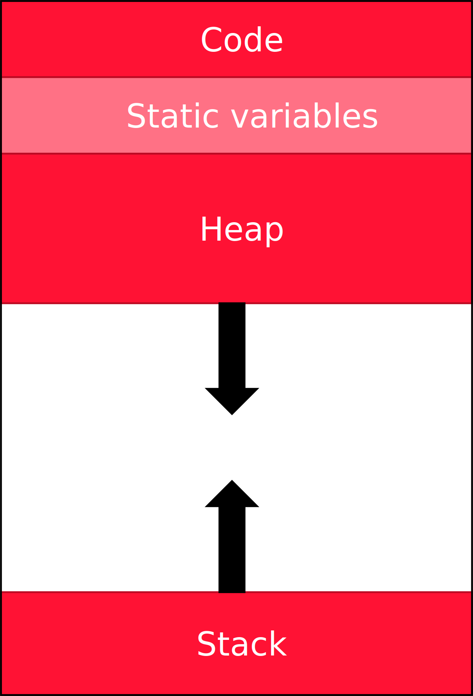

<!--
Ok, I simplify a bit here compared to what you’ve seen in Game Tech – but this abstraction gives us the relevant parts for this chapter.
This chapter is about the heap – it’s the only memory that we can control. Or abuse.
-->

---

# Managed vs Unmanaged languages

Unmanaged languages: C++, Objective C, ...
- Programs run directly on the device
- Programs compile to machine code
- You’re on your own to manage your memory.
  - Standard memory managers aren't that bad, only use your own managers if there is a need!

Managed languages: C#, Java, …
- Programs run on a virtual machine (CLR, JVM)
- Programs compile to an intermediate language (IL, bytecode)
- Executed by a JIT compiler
- Memory is managed by the *garbage collector* (GC)

---

# Garbage collector

No need to free any memory yourself.
- The GC checks whether objects are still referenced. If not, memory is freed.

Garbage collection occurs when one of the following conditions is true: 
- The system has low physical memory
- Occupied memory surpasses an acceptable threshold. This threshold is continuously adjusted as the process runs. 
- The ``GC.Collect`` method is called

Works on a managed heap
- Organized in 3 generations 
- Young objects in generation 0 are checked more often
  - They age 

Possible to perform defragmentation

---

# Garbage collector

Cool! No more worries! Alas - “There ain't no such thing as a free lunch”

It’s still possible to leak memory.
- Dangling references
- Growing collections

Garbage collection can take a while
- Spike on your FPS counter
- Modern GC are getting better at this.
- So this rule remains: *no dynamic memory allocation on your* **hot code path**

Cache coherence still needed 
- although the JIT compiler optimizes a lot

<!--
Everything we know about RAII in C++ still applies in managed languages. So you would still need to create some RAII method for network connections, db connections, etc.
So, in C++, how do we allocate memory normally?
-->

---
<!-- header: Memory allocators -->
# Memory allocators

Acquire heap memory with ``malloc`` or ``new``
Free heap memory with ``free`` or ``delete``

Costly operations 
- malloc and free might need to context-switch to go from user mode to kernel mode

Instead of doing this all the time, we could request a sufficiently sized chunk of memory and distribute that as required by the program/game
- Everything happens in user mode
- Better tweaked to the application’s needs

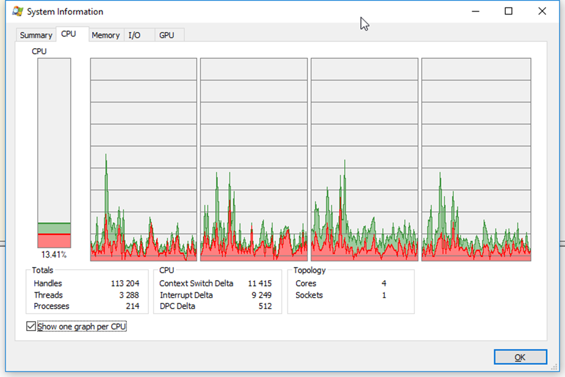

<!--
User mode vs kernel mode: in user mode the number of operations allowed to run on the cpu is restricted. To acquire memory we need to switch to kernel mode. This switch takes a bit of overhead.

Check out the task manager, the red part in the graphs is code executing in kernel mode.

What is the difference between new and malloc? And free and delete?
-->

---

# Linked-list-based allocators

General purpose allocators
- Keep track of free memory, the “free list”
- Keep track of the size of each allocated block – why?

---

# Linked-list-based allocators

General purpose allocators
- Keep track of free memory, the “free list”
- Keep track of the size of each allocated block – why?
  - When deleting/releasing memory we only provide the pointer to the memory that we want to release.

Suffer from fragmentation - but can we perform some defragmentation? Just sort all the allocated blocks up:


---

# Linked-list-based allocators

General purpose allocators
- Keep track of free memory, the “free list”
- Keep track of the size of each allocated block – why?
  - When deleting/releasing memory we only provide the pointer to the memory that we want to release.

Suffer from fragmentation - but can we perform some defragmentation? Just sort all the allocated blocks up:


Can be a lengthy operation, but doesn’t have to be completed in one frame. We can spend some fixed time on this every frame until we’re done.

However: raw pointers become invalid 
- Use (custom) smart pointers
- Use Handles – integer indices in a table that contains the actual pointers
- A handle is what every reference in C# or Java is

3rd party libraries might not be compatible

---

# Free storage list

Let's look at a possible implementation of such an allocator.

- Divide a given buffer into blocks.
- Keep a linked list of free blocks
- Since that memory is not used by the program, we can store our node pointers there

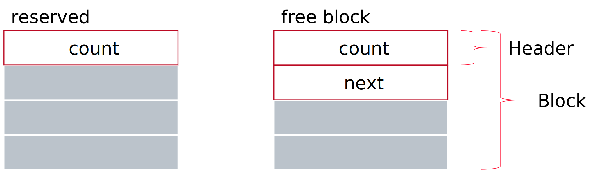

count = # subsequent free blocks

---

# Free storage list


```cpp
struct Header
{
    size_t count;
};

struct Block : Header
{
    const static int size = sizeof(void*);
    union
    {
        Block* next;
        char data[size - sizeof(Header)];
    };
};
```

---

# Free storage list

Acquire
- Iterate over the list until you find a large enough space.
- Remove it from the list.
- Return pointer to that memory.

Release
- Find the first empty block before the block to release.
- Add into the list.
- Merge the blocks if adjacent.

This list must remain sorted
- Makes releasing memory costly O(n)

---

# So what happens?

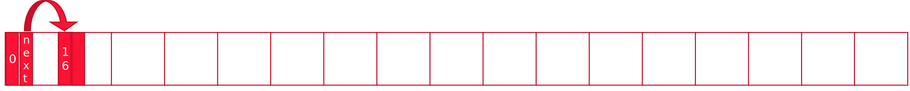

This is a buffer of 17 blocks. 
- Max allocated size = (16*16b)-4b = 252b
  - (we allocate one extra block for the head)
  - We loose 4b for that counter in every first block

What happens when we allocate 40b?

---

# So what happens?

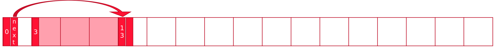

There are now 13 free blocks left. 
- Max allocated size = 16*13-4 = 204

What happens when we allocate another 40 bytes?

---

# So what happens?

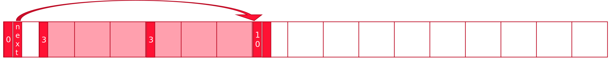

Now there are 10 free blocks. 
- Max allocated size = 16*10-4 = 156

Let's allocate two more.

---

# So what happens?

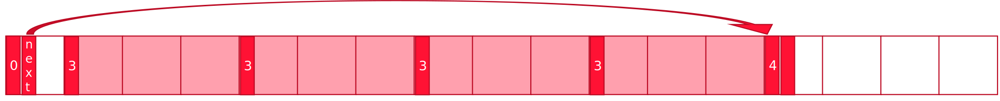

Fine, now let's free the 1st allocation we did

---

# So what happens?

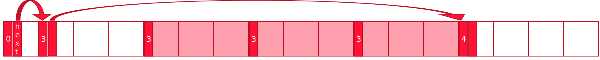

Now let's free the 3rd allocation we did

---

# So what happens?

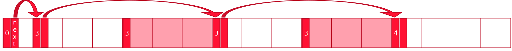

Finally free the 4th allocation we did

---

# So what happens?

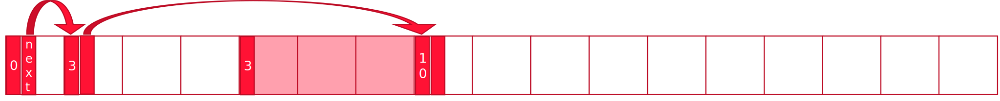

And we end up with this.

---

# Overriding new and delete

```cpp
namespace dae {
class MemoryAllocator;
}

void * operator new (size_t nbBytes);

void * operator new[] (size_t nbBytes);

void * operator new (size_t nbBytes, dae::MemoryAllocator* allocator);

void * operator new[] (size_t nbBytes, dae::MemoryAllocator* allocator);

void operator delete (void* pointerToBuffer) noexcept;

void operator delete[] (void* pointerToBuffer) noexcept;
```

---

# Overriding new and delete

Let's use these

```cpp
TEST_CASE("Test object 2")
{
    MyAllocator allocator(4096);
    Object* pObject = new (&allocator) Object();

    REQUIRE(pObject->m_integer == 0);
    REQUIRE(pObject->m_float == 0);

    delete pObject;
}
```

Look at that delete, it doesn't specify the allocator?

---

# Overriding new and delete

Let's use these

```cpp
TEST_CASE("Test object 2")
{
    MyAllocator allocator(4096);
    Object* pObject = new (&allocator) Object();

    REQUIRE(pObject->m_integer == 0);
    REQUIRE(pObject->m_float == 0);

    delete pObject;
}
```

Look at that delete, it doesn't specify the allocator?

Define a tag:

```cpp
struct Tag
{
    MemoryAllocator* pool;
};
```

---

# Overriding new and delete

And use it:

```cpp
void * operator new (size_t nbBytes, MemoryAllocator* allocator)
{
    if (nbBytes == 0) nbBytes = 1;
    MemoryAllocator::Tag* const tag = 
        reinterpret_cast<MemoryAllocator::Tag*>(
            allocator->Acquire(nbBytes + sizeof(MemoryAllocator::Tag))
        );
    tag->pool = allocator;
    return tag + 1;
}

void * operator new (size_t nbBytes)
{
    if (nbBytes == 0) nbBytes = 1;
    MemoryAllocator::Tag* const tag =
        reinterpret_cast<MemoryAllocator::Tag*>(
            malloc(nbBytes + sizeof(MemoryAllocator::Tag))
        );
    tag->pool = nullptr;
    return tag + 1;
}
```

---

# Overriding new and delete

So the delete now can become:

```cpp
void operator delete(void * pointerToBuffer) noexcept
{
    if (pointerToBuffer != nullptr)
    {
        MemoryAllocator::Tag* const tag = 
            reinterpret_cast<MemoryAllocator::Tag*> (pointerToBuffer) - 1;
        if (tag->pool != nullptr)
            tag->pool->Release(tag);
        else
            free(tag);
    }
}
```

---

# Using them

When we create a new GameObject we write either
```cpp
auto go(std::make_unique<GameObject>());
```
```cpp
auto go(std::make_shared<GameObject>());
```

Override global new and delete? 
- Ok, but then every allocation passes through our code
- Custom smart pointers

std::allocate_shared exists, but std::allocate_unique doesn’t
- Uses an Allocator (https://en.cppreference.com/w/cpp/named_req/Allocator)

Override Class-scope new/delete operator
- Can couple it to the required allocator.

<!-- 
That last option is what we did at Larian in the Gambryo Engine, we had a NiMemObject base class for everything.
-->

<sub>https://msdn.microsoft.com/en-us/library/kftdy56f.aspx</sub>

---

# std allocators

Downside: are passed as a class, not an instance.

See https://godbolt.org/z/7h8993bc5 as an example that illustrates this.

At EA this is one of the reasons to run their own stl (keep in mind, this is a page from 2007): 
https://www.open-std.org/jtc1/sc22/wg21/docs/papers/2007/n2271.html#std_allocator

Often engines have their own container types that allow for custom allocators by instance.


---

# Doubly-linked free storage

Resembles the single linked list
- Just keep an extra pointer to the previous node too.
- To support coalescing, we add a status bit in the length field

When Releasing, just add it to the free list. This has become a *0(1) operation*
When Acquiring, while traversing the free list, coalesce free areas.

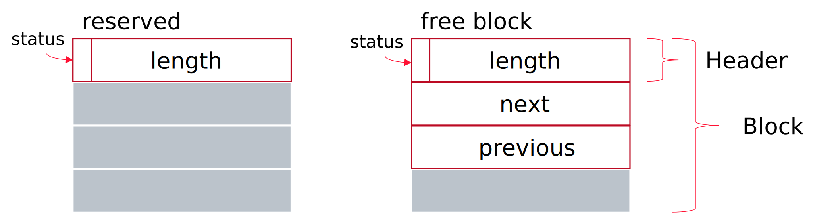

---

# Doubly-linked free storage

Acquire
- Iterate over all nodes in free list.
  - For each node: if the next area is free, merge the two areas
  - If the area is big enough: break;
- Chop off an area sized as required and add the remaining to the free area list
- Set status flags (free or not)

Release
- Just add it to the list
- Set status flag

---

# All purpose allocators

We saw two common all-purpose allocators.
Disadvantages:
- Slow O(n) operations on alloc and/or dealloc
- Fragmented memory

Advantages:
- No system calls
- We’re in charge ourselves

Let’s have a look at optimizations we can apply in games.

---

# Stack-based allocators

Acquire memory
- Via malloc
- Or new
- Or with a global static buffer
  - (the data will reside in the static segment)

Easy implementation – just increment a pointer
- No fragmentation
- Downside: releasing memory must happen in reverse order
  - Better alternative: use markers to free entire blocks
  - Even better: don't release at all!

---

# Stack allocator

Given en empty stack, from top to bottom.

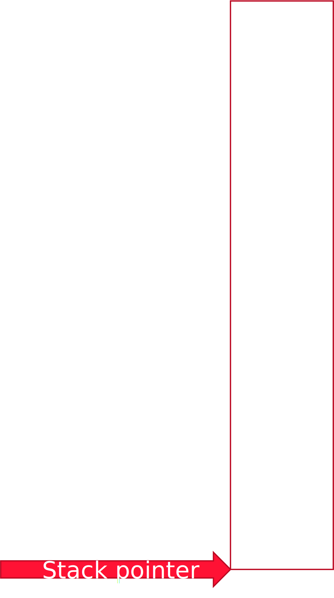

---

# Stack allocator

Allocate x bytes

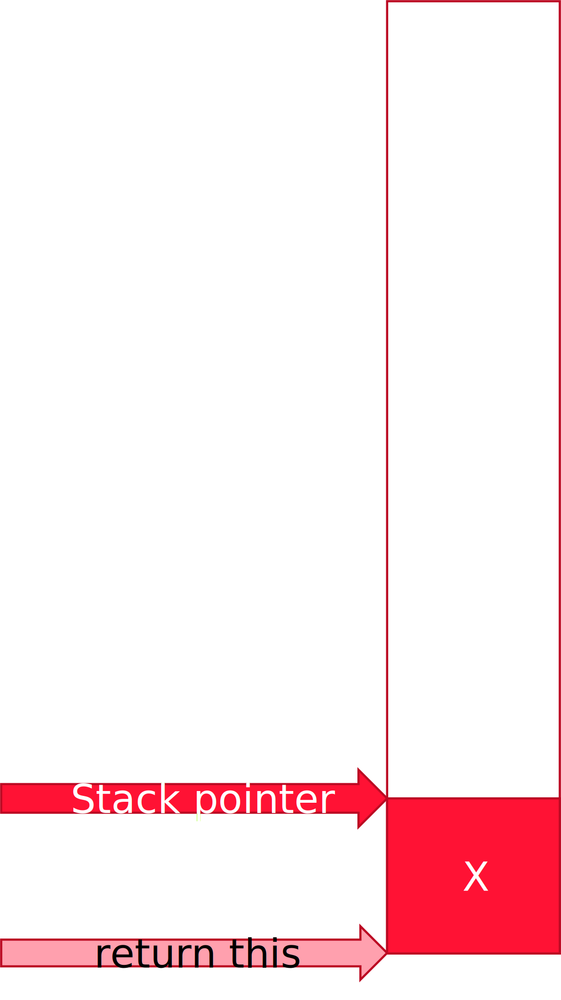

---

# Stack allocator

Optionally: request a marker

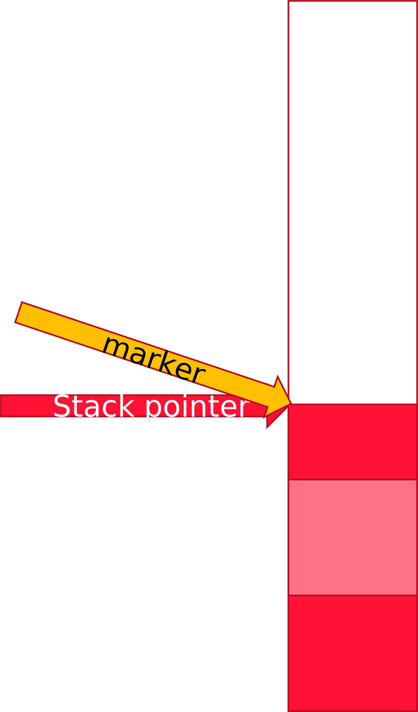

---

# Stack allocator

Allocate some more

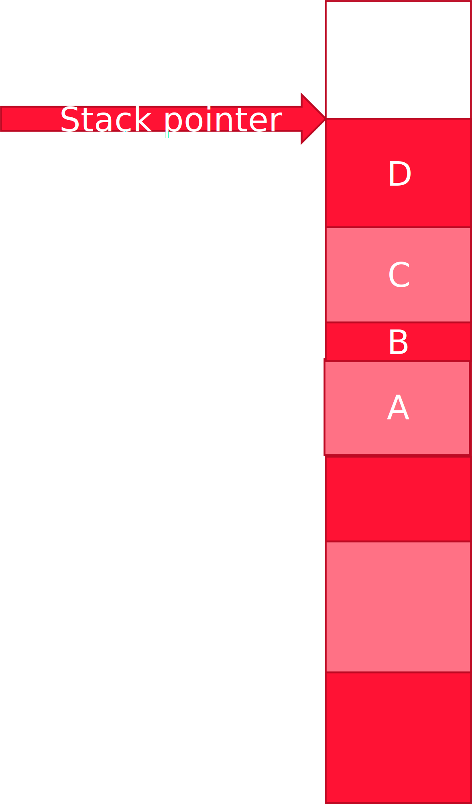

---

# Stack allocator

Now free to marker


---

# Stack allocator

Or just completely free the stack


---

# Single frame allocators

Reserve a block of memory, manage it with a stack allocator.
At the start of the frame we reset the stack pointer to the bottom.

Pro’s
- No need to free / delete the data
- Fast to allocate
- No fragmentation

Con’s
- Programmers must be well aware what they’re doing
- No persistent pointers to this data possible!

---

# Double-ended stack allocators

Use two stacks at each end.
Allocate a block and maintain a stack from both ends


For example:
- Use lower stack for level data – cleared every level.
- Use upper stack for frame data – cleared every frame.

---

# Double-buffered stack allocators

These allow the data allocated in frame i to be used in frame i+1

Create two single frame stack allocators internally and ping-pong between the two.

Used to use results from the previous frame in the current one.

---

# Object pools / Fixed size allocators

When
- You often create and destroy the same type of objects (bullets, particles, sounds, decals, etc.)
- The objects have the same size
- Allocating these on the heap leads to fragmentation

Or 
- the objects encapsulate a resource via RAII that is costly to acquire/release (like a network connection, a thread or a database connection)

You could choose to use an Object Pool
- Allocate a bunch of them
- Request objects from the pool and return them when you don’t need them anymore.
- The underlying resource remains acquired

---

# Object Pools/Fixed-size allocators

Possible waste of memory.
Possibly not enough memory.
- Prevent it (allocate max)
- Don’t create a new object
- Kill an existing object
- Grow

A reused object must be cleared – pay attention!

<!--
How much do you allocate? It can be too big or too small.

Often games have a dynamically sized object pool during testing/development. That way you can establish the average/maximum number of objects that were ever in the pool. For release you can then fix the size based on that analysis.

You can also choose to, when the pool is completely in use to not create any new ones. That’s probably fine for particles

Or kill an object that already exists. Valid for sound effects and often used for decals.
--->

---

# Small object allocator

Small objects cause the most fragmentation.
Create growing pool allocators for objects sized from 1 – 256 bytes, thus:
- A pool for objects of 1 byte,
- A pool for objects of 2 bytes,
- A pool for objects of 3 bytes,
- A pool for objects of 4 bytes,
- Etc...

Initialized with a size of 16 objects for each pool: takes ~500kb
How many bytes exactly?

<!-- Answer: 257*128*16 = 526336 -->

