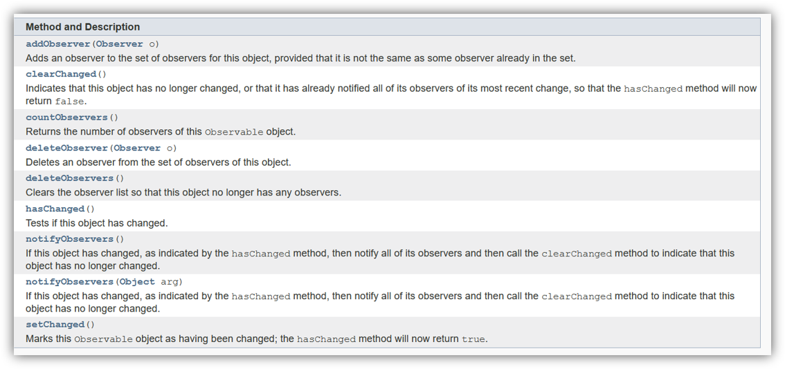
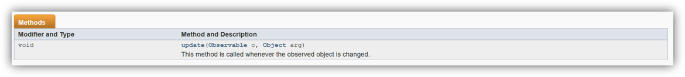

<!-- _class: title-slide-v2023 -->

# Observer & Event Queue

---
<!-- header: Software design patterns -->
<!-- paginate: true -->

# Problem statement

For example this achievement:


How would you implement this?

```cpp
void GameActor::Die()
{
  PlayDieSound();
  PlayDieAnim();

  if(NobodyDiedYet())  
    UnlockFirstBloodAchievement();

  FadeOut();
}
```

<!-- 
Achievement from Team Fortress 2
Not very portable, right? Ask for alternatives. Let’s see what they come up with.
Challenges: What about 100 kills. What about 20 kills with a flamethrower, etc... 
-->

<!-- footer: Programming 4  - Observer & Event Queue -->

---
# Problem statement

Or, even worse:


**Going Down?** is an achievement which is completed by falling 65 yards without dying. You have to end the fall on a "hard surface".

Goal is again: no tight coupling. 

<!-- 
Achievement from world of warcraft
You need to keep track of the height when you jumped, you compare it with the height when you land, you cannot die of it + it needs to be on a hard surface... 
-->

---
# Remember: no coupling


---
<!-- header: Observer -->
# Observer

Notify interested parties that a certain event took place. They have to decide what to do with that. 

In our example we notify interested parties that a certain actor in the game died:

```cpp
void GameActor::Die()
{
  PlayDieSound();
  PlayDieAnim();

  NotifyObservers(GameEvent::ActorDied);

  FadeOut();
}
```

These interested parties are called "observers" or "event handlers". In our example they implement an interface like this:

```cpp
class Observer
{
public:
  virtual ~Observer() = default;
  virtual void Notify(Event event, GameActor* actor) = 0;
}
```

<!-- 
This decouples code. The Physics engine can issue an event that an Entity fell, but whether or not there should be an achievement for that, or lives should be subtracted, or a level should be restarted is totally not up to the Physics engine.
Note: the observer interface does not have to be written like this, the Notify method can have whatever parameters you want and you can have multiple Notify methods too. Often you have an event and eventargs. 
-->

---
# Observer
An achievement system will typically be an observer. It should **not interfere with the game code** at all.

```cpp
class Achievement : public Observer
{
public:
  void Notify(Event event, GameActor* actor) override
  {
    switch(event) {
      case GameEvent::ActorDied:
        if(CheckIfNobodyElseDiedYet(actor)) {
          Unlock(Achievement::FirstBlood);
        }
        break;
      case GameEvent::ActorFell:
        // etc...
    }
  }

private:
  void Unlock(Achievement achievement) {
    // code to unlock an achievement...
  }
}
```

---
# Subject
The observed class gets some extra state – it needs to track who’s observing (**but not what!**). This observed class is called the **subject**.

```cpp
class GameActor
{
public:
  void AddObserver(Observer* observer) {
    // code to add an observer
  }
  void RemoveObserver(Observer* observer) {
    // code to remove an observer
  }

protected:
  void NotifyObservers(Event event) {
    for(auto observer : m_observers)
      observer->Notify(event, this);
  }

private:
  std::vector<Observer*> m_observers;
}
```

<!-- Keep in mind: the parameters of the Notify function don’t have to be the ones as we present here. That’s why it is a pattern – adapt it to your needs. -->


---
# Considerations

- The observers in the subject state: can we afford the extra memory?
  - Should they be kept in an extra buffer as in the example?

- When we delete the subject: what do we do with the observers?
  - Nothing?
  - Delete them?
  - Notify them?
  - In GC languages this is certainly an issue!

- When we Notify the observers, what data do we send them?
  - Nothing – they can just get the data (= pull model)
  - Everything = push model
  - Only the altered state

<!-- In GC languages, if you remove an observer, you’ll need some Destroy() method that unregisters them from the subject, you don’t have a destructor to do that. = lapsed listener problem -->

---
# Implementations

To alleviate the memory cost, you could keep a pointer to a Subject class

```cpp
class GameActor
{
public:
  void Die() {
    PlayDieSound();
    PlayDieAnim();
    m_actorDiedEvent->NotifyObservers();
    FadeOut(); 
  }

private:
  std::unique_ptr<Subject> m_actorDiedEvent;
}
```
- This is exactly what events are in C#
- This is exactly what UnityEvents are in Unity
- This is exactly what multicast delegates are in Unreal
- Java has a similar system and even an Observer and Observable class.

---
# Java
In java a subject class can inherit from “Observable”



<sub>https://docs.oracle.com/javase/7/docs/api/java/util/Observable.html</sub>

---
# Java

And the Observer implements the interface "Observer"



<sub>https://docs.oracle.com/javase/7/docs/api/java/util/Observer.html</sub>


This may suffer from the **lapsed listener problem**.

In C++, where we have no GC we can make use of shared and weak pointers to avoid this issue, or use the destructor to unsubscribe.

---

# Unreal

In Unreal you'd add an event (which is a multicast delegate) in your header file:

```cpp
public:
  DECLARE_MULTICAST_DELEGATE(FMyEvent)
  FMyEvent& OnSwitched() { return SwitchedEvent; }
private:
  FMyEvent SwitchedEvent;
```

Which you then can broadcast

```cpp
void AMyActor::MyFunction()
{
    SwitchedEvent.Broadcast();
}
```

And subscribe to

```cpp
Actor->OnSwitched().AddUFunction(this, "ToggleDoor");
```

<sub>https://docs.unrealengine.com/5.3/en-US/multicast-delegates-in-unreal-engine/</sub>

---

# Implementations

It’s often not interesting or possible to know the source of an event.
- If there are many actors and you need to know if one died but you don’t care which one
- You don’t want to couple the observer to the subject
- Or the same event can be issued by multiple subjects
  - For example, “DialogEnded” can be issued by all dialogs – do you want to track them all?

In that case: use an event queue / message queue instead.

---
<!-- header: Event queue -->
# Event queue

We've already seen one:

```cpp
bool dae::InputManager::ProcessInput()
{
  SDL_Event e;
  while (SDL_PollEvent(&e)) {
    if (e.type == SDL_QUIT) {
      return false;
    }
    if (e.type == SDL_KEYDOWN) {
      
    }
    if (e.type == SDL_MOUSEBUTTONDOWN) {
      
    }
    //process event for IMGUI
    ImGui_ImplSDL2_ProcessEvent(&e);
  }
}
```

---
# Event queue

**Observer** decouples the sender from the receiver
- Sender does not know who’s listening
- But the observer knows who it is listening to

**Event Queue** also decouples the receiver from the sender
- Sender does not know who’s listening
- Receiver does not need to know who issued the event/message
- Receiver doesn't have to handle the message/request immediatly

Unsurprisingly, this works with a queue
- (ideally implemented as a ring buffer)

---
# Usage example

When can we use this? For example in our ``GameActor::Die`` function we needed to play a sound. That function could call this function:

```cpp
void PlaySound(SoundId id, int volume)
{
  auto sound = LoadSound(id);
  int channel = FindOpenChannel();
  if(channel == -1) return;
  StartPlayingSound(sound, channel, volume);
}
```
This has 3 issues:

---
# Usage example

When can we use this? For example in our ``GameActor::Die`` function we needed to play a sound. That function could call this function:

```cpp
void PlaySound(SoundId id, int volume)
{
  auto sound = LoadSound(id);
  int channel = FindOpenChannel();
  if(channel == -1) return;
  StartPlayingSound(sound, channel, volume);
}
```
This has 3 issues:

1. The call is blocking/synchronous and can take a while
2. The call is not thread safe
3. The call is executed by the wrong thread.

So instead we could implement an event queue in the Audio API, that will process audio play requests on a separate thread.

---
# Another example (C#)

```cs
Messenger.Broadcast(Messages.DialogStarted, new DialogArgs {
  dialogId = DialogueManager.instance.LastConversationID,
  title = DialogueManager.instance.lastConversationStarted
});
```

```cs
private void Start()
{
  _fpController = GetComponent<FPController>();
  Messenger.AddListener<DialogArgs>(Messages.DialogStarted, OnDialogStarted);
  Messenger.AddListener<DialogArgs>(Messages.DialogEnded, OnDialogEnded);
}
```

```cs
private void OnDialogStarted(DialogArgs args)
{
  bool rileyWalks = DialogueLua.GetActorField("Riley", "CanWalk").AsBool;
  if (!rileyWalks) {
      _fpController.DisableWalking();
  }
}
```
---
# Another example (C++)

```cpp
void dae::GameOverChecker::DisplayGameOver(const std::string& text) {
  EventManager::GetInstance().SendEvent(GameOverEventID);
  auto textComponent = GetOwner()->GetComponent<TextComponent>();
  textComponent->SetText(text, true);
  SetEnabled(false);
}
```

```cpp
void dae::Ghost::Init() {
  EventManager::GetInstance().AttachEvent(GameOverEventID, handler);
  EventManager::GetInstance().AttachEvent(BoostStartEventID, handler);
  EventManager::GetInstance().AttachEvent(BoostEndEventID, handler);
}
```

```cpp
void dae::Ghost::HandleEvent(const Event* pEvent) {
  switch(pEvent->GetID())
  {
  case GameOverEventID:
    ChangeToState(std::make_unique<GameOverState>(this));
    break;
  case BoostStartEventID:
    // etc...
  }
}
```

<!-- Check the book for extra examples, even something in there with a ring buffer which is good for memory and data locality. -->

---
# Considerations

- Central Event Queues (like my Messenger system) are Global Variables
- What happens with events that became obsolete?
- Infinite loops
- One to One, One to Many, Many to One, Many to Many?
  - Many to One 
    - like with the audio
  - xx to Many
    - All listeners get the event/message? 
    - Or only the first? Like a worker that takes the next task from a queue?
  - One to xx
    - Observer pattern
- What about ownership of the objects in the queue?

<!-- 
2nd bullet: By the time an event gets processed, it might not be necessary anymore, how do you handle that?
3rd bullet: If an eventhandler invokes an event that triggers the same handler you’re stuck. In a single threaded environment that’s fine, you’ll get a stackoverflow, but in a multithreaded context you’ll be keeping your CPU’s busy.
5th bullet: Pass ownership: caller to queue to receiver, or share ownership (with shared ptr) or the queue owns.
-->

--- 
# Event Id

<div class="columns"><div>

Has two parts
- Type (or Name, or Id)
- Arguments

“EventId” like this? What are the pros and cons?

</div><div>

```cpp
struct EventArg{};

struct Event {
  const std::string id;

  static const uint8_t MAX_ARGS = 8;
  uint8_t nbArgs;
  EventArg args[MAX_ARGS];

  explicit Event(const char* _id) : id{_id} {}
};
```
```cpp
Event e("PlayerDied");
```
```cpp
if(e.id == "PlayerDied") {
  // handle player death event
}
```

</div>

<!-- string comparisons! -->

---

# Event Id

<div class="columns"><div>

Has two parts
- Type (or Name, or Id)
- Arguments

“EventId” like this? What are the pros and cons?

</div><div>

```cpp
struct EventArg{};

enum EventId {
  LEVEL_STARTED,
  BOMB_EXPLODED,
  PLAYER_DIED,
  //...
};

struct Event {
  const EventId id;  

  static const uint8_t MAX_ARGS = 8;
  uint8_t nbArgs;
  EventArg args[MAX_ARGS];

  explicit Event(EventId _id) : id{_id} {}
}
```
```cpp
Event e(PLAYER_DIED);
```
```cpp
if(e.id == PLAYER_DIED) {
  // handle player death event
}
```

</div>

<!-- 
enums/ints are easy to compare, but list needs to be known in advance 
no scoped enums :)
-->

---

# Event Id

<div class="columns"><div>

Yes! No scoped enums.


Has two parts
- Type (or Name, or Id)
- Arguments

“EventId” like this? What are the pros and cons?


</div><div>

```cpp
struct EventArg{};

enum class EventId {
  LEVEL_STARTED,
  BOMB_EXPLODED,
  PLAYER_DIED,
  //...
};

struct Event {
  const EventId id;  

  static const uint8_t MAX_ARGS = 8;
  uint8_t nbArgs;
  EventArg args[MAX_ARGS];

  explicit Event(EventId _id) : id{_id} {}
}
```
```cpp
Event e(EventId::PLAYER_DIED);
```
```cpp
if(e.id == EventId::PLAYER_DIED) {
  // handle player death event
}
```

</div>

--- 

# Event Id

- With strings
  - Id's don't need to be known in advance :smile:
  - String comparisons :sob:
- With a **scoped** enum 
  - Fast comparison/indexing :smile:
  - All events are declared in one place :cry:
  - Can’t be extended :sob:

Applicable for small projects where either perfomance or extendability are not that important.

Any other options?

---

# Event Id

We could make use of an SDBM hash

```cpp
unsigned int sdbm_hash(const char *str) {
    unsigned int hash = 0;
    int c;

    while ((c = *str++)) {
        hash = c + (hash << 6) + (hash << 16) - hash;
    }

    return hash;
}
```
This function generates a simple (non-secure) hash of a given string in O(n) time.

Instead of EventId as a string or an enum we simply use an unsigned int and we generate id's with text:

```cpp
Event e(sdbm_hash("PlayerDied"));
```

But what is the downside now?

<sub>http://www.cse.yorku.ca/~oz/hash.html</sub>

<!-- 
Downside is that this needs to be calculated at runtime.
-->

---

# Event Id

```cpp
template <int length> struct sdbm_hash 
{
    constexpr static unsigned int _calculate(const char* const text, unsigned int& value) {
        const unsigned int character = sdbm_hash<length - 1>::_calculate(text, value);
        value = character + (value << 6) + (value << 16) - value;
        return text[length - 1];
    }

    constexpr static unsigned int calculate(const char* const text) {
        unsigned int value = 0;
        const auto character = _calculate(text, value);
        return character + (value << 6) + (value << 16) - value;
    }
};

template <> struct sdbm_hash<1> {
    constexpr static int _calculate(const char* const text, unsigned int& ) { return text[0]; }
};

template <size_t N> constexpr unsigned int make_sdbm_hash(const char (&text)[N]) {
    return sdbm_hash<N - 1>::calculate(text);
}
```

<sub>Inspired by: *"Learn C++ For Game Development"*</sub>

<!-- 
The last method I've added myself: In C++, string literals like "QuitEvent" are of type const char[N], where N includes the null terminator ('\0'). When a function template takes an array by reference (e.g., const char (&text)[N]), the compiler deduces the size of the array (N) automatically.
-->

---

# Event Id

And now we can write:

```cpp
struct EventArg{};

using EventId = unsigned int;

struct Event {
  const EventId id;

  static const uint8_t MAX_ARGS = 8;
  uint8_t nbArgs;
  EventArg args[MAX_ARGS];

  explicit Event(EventId _id) : id{_id} {}
}
```
```cpp
Event e(make_sdbm_hash("PlayerDied"));
```
```cpp
if(e.id == make_sdbm_hash("PlayerDied")) {
  // handle player death event
}
```