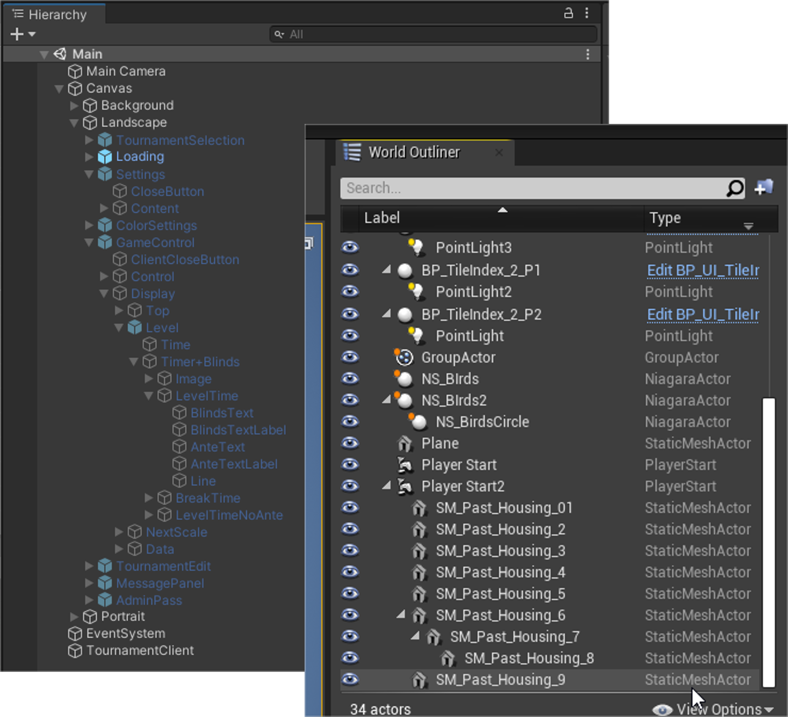
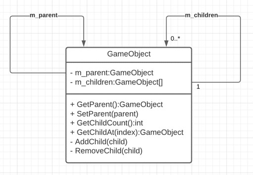
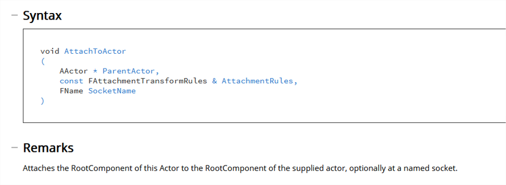
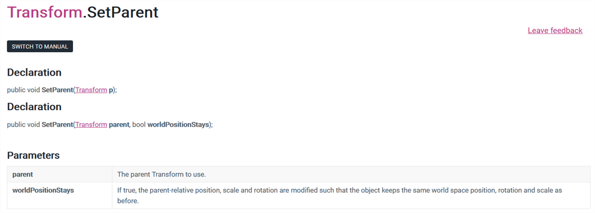
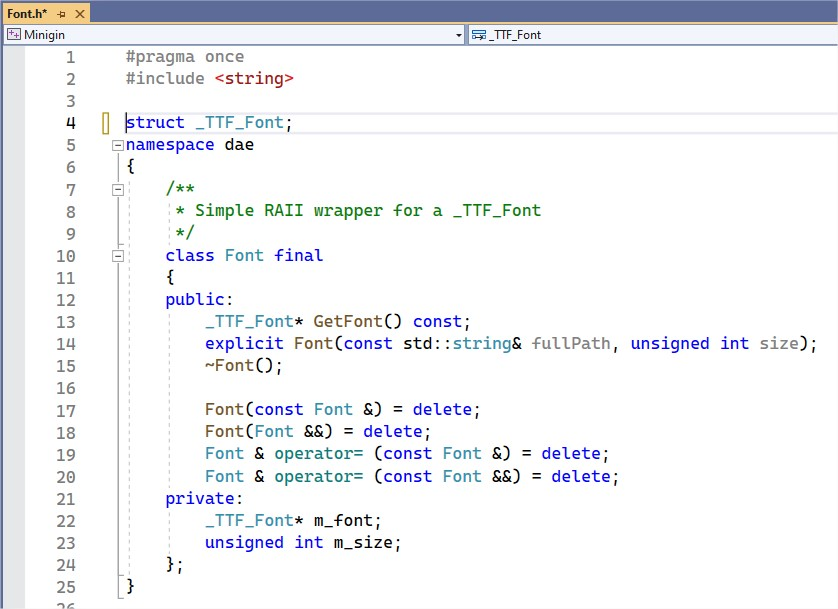

<!-- _class: title-slide-v2023 -->

# Scenegraph & Dirty flag

<!-- footer: Programming 4 -->

---
<!-- header: Scenegraph -->
<!-- paginate: true -->

# Components and their owner

We saw this a lot... what's wrong with this? (4 things at least)

```cpp
class GameObject;
class BaseComponent
{
  public:
    BaseComponent() = default;
    virtual ~BaseComponent() = default;
    BaseComponent(const BaseComponent& other) = delete;
    BaseComponent(BaseComponent&& other) = delete;
    BaseComponent& operator=(const BaseComponent& other) = delete;
    BaseComponent& operator=(BaseComponent&& other) = delete;

    virtual void Update() = 0;
    virtual void FixedUpdate() = 0;

    void SetOwner(GameObject* pOwner) { m_pOwner = pOwner; };
  protected:
    GameObject* m_pOwner{};
};
```

<!-- 
- public default constructor: component can exist without owner
- owner pointer is protected, any subclass can mess things up
- setowner method: possible to set nullpointer
- setowner method: does not remove from the previous owner
-->

---

# Components and their owner

Slightly better...

```cpp
class GameObject;
class BaseComponent
{
     GameObject* m_pOwner;
  public:
     BaseComponent(GameObject* pOwner) : m_pOwner(pOwner) {};
     virtual ~BaseComponent() = default;
     BaseComponent(const BaseComponent& other) = delete;
     BaseComponent(BaseComponent&& other) = delete;
     BaseComponent& operator=(const BaseComponent& other) = delete;
     BaseComponent& operator=(BaseComponent&& other) = delete;

     virtual void Update() = 0;
     virtual void FixedUpdate() = 0;

     void SetOwner(GameObject* pOwner) { m_pOwner = pOwner; };
  protected:
     GameObject* GetOwner() const { return m_pOwner; }
};
```

---

# Components and their owner

SetOwner has to do **four** things:
- Check if the new owner is not null
- Remove itself as a component from the previous owner.
- Set the given owner on itself.
- Add itself as a component to the given parent.

```cpp
void SetOwner(GameObject* pOwner) 
{ 
  assert(pOwner);
  if (!pOwner)
    return;
  if (m_pOwner)
    m_pOwner->RemoveComponent(this);
  m_pOwner = pOwner; 
  m_pOwner->AddComponent(this);
}
```

Good idea?

<!-- 
No: other components might still reference that component assuming they're sharing a parent.
-->

---

# Components and their owner

Better

```cpp
class GameObject;
class BaseComponent
{
    GameObject* m_pOwner;
  public:
    virtual ~BaseComponent() = default;
    BaseComponent(const BaseComponent& other) = delete;
    BaseComponent(BaseComponent&& other) = delete;
    BaseComponent& operator=(const BaseComponent& other) = delete;
    BaseComponent& operator=(BaseComponent&& other) = delete;

    virtual void Update() = 0;
    virtual void FixedUpdate() = 0;
  protected:
    explicit BaseComponent(GameObject* pOwner) : m_pOwner(pOwner) {}
    GameObject* GetOwner() const { return m_pOwner; }
};
```

---

# Structure



Well known in engines and 3D modelling software

Hierarchical structure of objects in the scene


---

# Structure



Variations are possible, but: each method must ensure that you end up with a correct parent-child relationship when it’s done.

Pay close attention to this diagram, it clearly documents what methods you need and how you should implement them.

---

# Implementation

Is this correct?

```cpp
void SetParent(GameObject* parent) { m_parent = parent; }

GameObject* GetParent() const { return m_parent; }

size_t GetChildCount() const { return m_children.size(); }

GameObject* GetChildAt(unsigned int index) const { return m_children[index]; }

void RemoveChild(GameObject* child) { 
  m_children.erase(std::remove(m_children.begin(), m_children.end(), child), m_children.end()); 
}

void AddChild(GameObject* child) { m_children.emplace_back(child); }
```

---

# How then?

<div class="columns" style="font-size: 32px;"><div>

SetParent has to do **five** things:

</div></div>

---

# How then?

<div class="columns" style="font-size: 32px;"><div>

SetParent has to do **five** things:
- Check if the new parent is valid (not itself or one of its children)
- Remove itself as a child from the previous parent (if any).
- Set the given parent on itself.
- Add itself as a child to the given parent.
- Update position, rotation and scale

</div></div>

---

# How then?

<div class="columns" style="font-size: 32px;"><div>

SetParent has to do **five** things:
- Check if the new parent is valid (not itself or one of its children)
- Remove itself from the previous parent (if any).
- Set the given parent on itself.
- Add itself as a child to the given parent.
- Update position, rotation and scale

AddChild has to do **five** things

</div></div>

---

# How then?

<div class="columns" style="font-size: 32px;"><div>

SetParent has to do **five** things:
- Check if the new parent is valid (not itself or one of its children)
- Remove itself from the previous parent (if any).
- Set the given parent on itself.
- Add itself as a child to the given parent.
- Update position, rotation and scale

AddChild has to do **five** things
- Check if the new child is valid (not null and not one of its parents)
- Remove the given child from the child's previous parent
- Set itself as parent of the child
- Add the child to its children list.
- Update position, rotation and scale

</div></div>

---

# How then?

<div class="columns" style="font-size: 32px;"><div >

SetParent has to do **five** things:
- Check if the new parent is valid (not itself or one of its children)
- Remove itself from the previous parent (if any).
- Set the given parent on itself.
- Add itself as a child to the given parent.
- Update position, rotation and scale

AddChild has to do **five** things
- Check if the new child is valid (not null and not one of its parents)
- Remove the given child from the child's previous parent
- Set itself as parent of the child
- Add the child to its children list.
- Update position, rotation and scale

</div><div>

RemoveChild has to do **four** things

</div></div>

---

# How then?

<div class="columns" style="font-size: 32px;"><div >

SetParent has to do **five** things:
- Check if the new parent is valid (not itself or one of its children)
- Remove itself from the previous parent (if any).
- Set the given parent on itself.
- Add itself as a child to the given parent.
- Update position, rotation and scale

AddChild has to do **five** things
- Check if the new child is valid (not null and not one of its parents)
- Remove the given child from the child's previous parent
- Set itself as parent of the child
- Add the child to its children list.
- Update position, rotation and scale

</div><div>

RemoveChild has to do **four** things
- Check if the child is valid (not null and one of its children)
- Remove the given child from the children list
- Remove itself as a parent of the child.
- Update position, rotation and scale

</div></div>

---

# How then?

<div class="columns" style="font-size: 32px;"><div >

SetParent has to do **five** things:
- Check if the new parent is valid (not itself or one of its children)
- Remove itself from the previous parent (```RemoveChild```?).
- Set the given parent on itself.
- Add itself as a child to the given parent (```AddChild```?).
- Update position, rotation and scale

AddChild has to do **five** things
- Check if the new child is valid (not null and not one of its parents)
- Remove the given child from the child's previous parent (```RemoveChild```?)
- Set itself as parent of the child (```SetParent```?)
- Add the child to its children list.
- Update position, rotation and scale

</div><div>

RemoveChild has to do **four** things
- Check if the child is valid (not null and one of its children)
- Remove the given child from the children list
- Remove itself as a parent of the child. (```SetParent```?)
- Update position, rotation and scale


Can SetParent use AddChild to do its job? 
Can AddChild use SetParent to do its job?

</div></div>


---

# How then?

<div class="columns" style="font-size: 32px;"><div >

SetParent has to do **five** things:
- Check if the new parent is valid (not itself or one of its children)
- Update position, rotation and scale
- Remove itself from the previous parent (```RemoveChild```?).
- Set the given parent on itself.
- Add itself as a child to the given parent (```AddChild```?).

AddChild has to do **five** things
- Check if the new child is valid (not null and not one of its parents)
- Update position, rotation and scale
- Remove the given child from the child's previous parent (```RemoveChild```?)
- Set itself as parent of the child (```SetParent```?)
- Add the child to its children list.

</div><div>

RemoveChild has to do **four** things
- Check if the child is valid (not null and one of its children)
- Update position, rotation and scale
- Remove the given child from the children list
- Remove itself as a parent of the child. (```SetParent```?)

Can SetParent use AddChild to do its job? 
Can AddChild use SetParent to do its job?
No – stack overflow would happen


Do we really need AddChild/RemoveChild?
No, being able to set the parent on a GameObject is enough.
Set the parent to nullptr to remove the child from its parent.

</div></div>

---

<!-- header: Game programming patterns - Dirty flag -->

# SetParent

When changing the parent, does the child stay at the same place in the world, or not? 

---

# SetParent

When changing the parent, does the child stay at the same place in the world, or not? 
It depends on the use case, you'll need to provide some options for your users.




---

# Local vs World space

An objects size, position and rotation in the game world
- Can be expressed in global terms (world space)
- Can be expressed in local terms, relative to the parent (local space)

If no parent, local space == world space

Adding a game object to a parent means either:
- The position in local space changes
- The position in global space changes

When the position of a parent changes, the position of the children change too (in world space).
- When do we calculate the world space transform? Immediately when moving the parent?

---

# Local vs World space

An objects size, position and rotation in the game world
- Can be expressed in global terms (world space)
- Can be expressed in local terms, relative to the parent (local space)

If no parent, local space == world space

Adding a game object to a parent means either:
- The position in local space changes
- The position in global space changes

When the position of a parent changes, the position of the children change too (in world space).
- When do we calculate the world space transform? Immediately when moving the parent?
- Better: only when we need it.

---

# Local vs World space

Like this?

```cpp
glm::vec3 Transform::GetWorldPosition() const
{
  if(m_parent != nullptr)
    return m_parent->GetWorldPosition() + GetLocalPosition();
  return GetLocalPosition();
}
```

<!-- Recalculates every time, recursively! -->

--- 

# Dirty flag

“A set of **primary data** changes over time. A set of **derived data** is determined from this using some **expensive process**. A **“dirty” flag** tracks when the derived data is out of sync with the primary data. It is **set when the primary data changes**. If the flag is set when the derived data is needed, then **it is reprocessed and the flag is cleared**. Otherwise, the previous **cached derived data** is used.”

What is primary and derived in our context?

--- 

# Dirty flag

“A set of **primary data** changes over time. A set of **derived data** is determined from this using some **expensive process**. A **“dirty” flag** tracks when the derived data is out of sync with the primary data. It is **set when the primary data changes**. If the flag is set when the derived data is needed, then **it is reprocessed and the flag is cleared**. Otherwise, the previous **cached derived data** is used.”

What is primary and derived in our context?
- Local transform is primary
- World transform is derived

What other example have you seen in Minigin?

<!-- TextObject or TextComponent had it too. -->

---

# Dirty flag

```cpp
void SetParent(GameObject* parent, bool keepWorldPosition)
{
  if(IsChild(parent) || parent == this || m_parent == parent)
    return;
  if (parent == nullptr)
    SetLocalPosition(GetWorldPosition());
  else
  {
    if (keepWorldPosition)
      SetLocalPosition(GetWorldPosition() - parent->GetWorldPosition());
    SetPositionDirty()
  }
  if(m_parent) m_parent->RemoveChild(this);
  m_parent = parent;
  if(m_parent) m_parent->AddChild(this)
}

void SetLocalPosition(const glm::vec3& pos)
{
    m_localPosition = pos;
    SetPositionDirty();
}
```

---

# Dirty flag

```cpp
const glm::vec3& GetWorldPosition()
{
  if (m_positionIsDirty)
    UpdateWorldPosition();
  return m_worldPosition;
}

void UpdateWorldPosition() 
{
  if(m_positionIsDirty)
  {
    if (m_parent == nullptr)
      m_worldPosition = m_localPosition;
    else
      m_worldPosition = m_parent->GetWorldPosition() + m_localPosition;
  }
  m_positionIsDirty = false;
}
```

--- 

# Considerations

**The primary data has to change more often than the derived data is used.**
- If you always need the derived data when the primary changes, you can just as well derive it immediately.

**It should be hard/costly to update incrementally.**
- Calculating the derived data is a lengthy/costly operation, otherwise just do it.
- Think about the hot/cold path! 

**When is the flag cleared?**
- When the result is needed (as in the example)
- At well-defined checkpoints
- In the background

---

# Find the dirty flag

