<!-- _class: title-slide-v2023 -->

# State & Double Buffer

<!-- footer: Programming 4 -->

---
<!-- header: Game programming patterns - State -->
<!-- paginate: true -->

# State

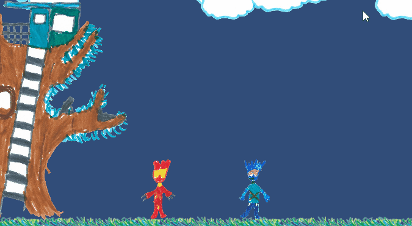

<!-- This is a "game" I made with my 7-year old. I was the programmer, she (obviously) the artist. -->

---

# Great success!

<center><video controls="controls" align="center" width="1500" src="mira_ada.mp4"></video></center>

---

<!-- header: Software design patterns -->

# Implementation

(Unity - C#)

```cs
private void Update()
{
    HandleInput();
    UpdatePosition();
}

void HandleInput()
{
    _velocity.x = Input.GetAxis(_horizontalAxisName) * movementSpeed;

    if (Input.GetButtonDown(_jumpAxisName))
    {
        _velocity.y = jumpHeight;
        _renderer.sprite = jumpSprite;
    }
}
```

---

# Whoops

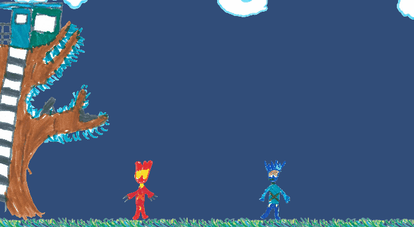

<!-- [Fait divers] While the double jump was a bug in my eyes, the children loved it. When I fixed it they complained that they couldn't jump on the clouds anymore and to infinity. I put it back in. -->

---
# IsJumping

(Unity - C#)

```cs
void HandleInput()
{
    _velocity.x = Input.GetAxis(_horizontalAxisName) * movementSpeed;

    if (!_isJumping && Input.GetButtonDown(_jumpAxisName))
    {
        _isJumping = true;
        _velocity.y = jumpHeight;
        _renderer.sprite = jumpSprite;
    }
}
```

---

# Ducking

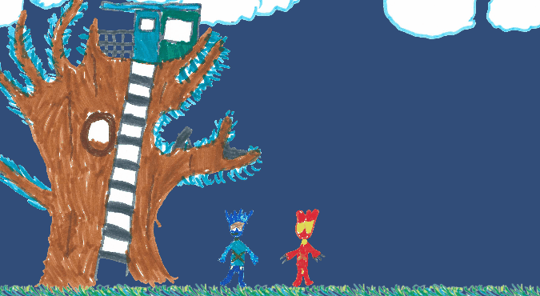

<!-- So now let's add a duck command -->

---
# Ducking

(Unity - C#)

```cs
void HandleInput()
{
    _velocity.x = Input.GetAxis(_horizontalAxisName) * movementSpeed;

    if (Input.GetButtonDown(_jumpAxisName))
    {
        _velocity.y = jumpHeight;
        _renderer.sprite = jumpSprite;
    }
    else if(Input.GetButtonDown(_duckAxisName))
    {
        if(!_isJumping)
        {
            _renderer.sprite = duckSprite;
        }
    }
    else if(Input.GetButtonUp(_duckAxisName))
    {
        _renderer.sprite = idleSprite;
    }
}
```

<!-- What's the bug here now? -->

---

# Whoops

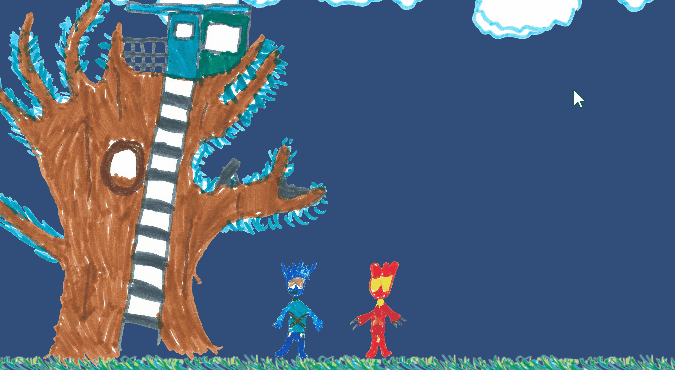

---
# No problemo, we're professionals!

```cs
void HandleInput()
{
    _velocity.x = Input.GetAxis(_horizontalAxisName) * movementSpeed;

    if (Input.GetButtonDown(_jumpAxisName)) {
        _velocity.y = jumpHeight;
        _renderer.sprite = jumpSprite;
    }
    else if(Input.GetButtonDown(_duckAxisName)) {
        if(!_isJumping)
        {
            _isDucking = true;
            _renderer.sprite = duckSprite;
        }
    }
    else if(Input.GetButtonUp(_duckAxisName)) {
        if(_isDucking)
        {
            _isDucking = false;
            _renderer.sprite = idleSprite;
        }
    }
}
```

---
# Add mid-air diving

```cs
void HandleInput()
{
    _velocity.x = Input.GetAxis(_horizontalAxisName) * movementSpeed;

    if (Input.GetButtonDown(_jumpAxisName)) {
        _velocity.y = jumpHeight;
        _renderer.sprite = jumpSprite;
    }
    else if(Input.GetButtonDown(_duckAxisName)) {
        if(!_isJumping) {
            _isDucking = true;
            _renderer.sprite = duckSprite;
        }
        else {
            _isJumping = false;
            _velocity.y = -jumpHeight;
            _renderer.sprite = diveSprite;
        }
    }
    else if(Input.GetButtonUp(_duckAxisName)) {
        if(_isDucking)
        {
            _isDucking = false;
            _renderer.sprite = idleSprite;
        }
    }
}
```

<!-- Start finding the bug now. (we can air jump during diving).  -->

---

# FSM


Enter the FSM - Finite State Machine

- **Finite** number of **states**
- The machine is always in **one state**
- Each state has a set of **transitions** to other states
- Which are triggered by **inputs** and **events**.

<!-- what state transitions are missing here? -->

---

# Implementation

<div class="columns"><div>

How to implement this?
- With enums and switches
- With lambda's / functors
- With coroutines


Can be ok - if the FSM is small and it's not used in many places in the code.
</div><div>

<style scoped> code { font-size: 25px; } </style>

```cs
enum CharacterStates{
    Jumping,
    Idle,
    Ducking,
    Diving
}
CharacterStates _currentState;
void HandleInput()
{
    _velocity.x = Input.GetAxis(_horizontalAxisName) * movementSpeed;
    switch (_currentState)
    {
        case CharacterStates.Idle:
            if (Input.GetButtonDown(_jumpAxisName)) {
                _renderer.sprite = jumpSprite;
                _velocity.y = jumpHeight;
                _currentState = CharacterStates.Jumping;
            } else if (Input.GetButtonDown(_duckAxisName)) {
                _renderer.sprite = duckSprite;
                _currentState = CharacterStates.Ducking;
            }
            break;
        case CharacterStates.Jumping:
            if (Input.GetButtonDown(_duckAxisName)) {
                _renderer.sprite = diveSprite;
                _currentState = CharacterStates.Diving;
            }
            break;
        case CharacterStates.Ducking:
            if (Input.GetButtonUp(_duckAxisName)) {
                _renderer.sprite = idleSprite;
                _currentState = CharacterStates.Idle;
            }
            break;
    }
}
```

</div></div>

---
# Enter the state pattern.


---
# Implementation

Option one: using static instances, set the new state

```cs
abstract class PlayerState {
    public static StandingState standing = new StandingState();
    public static DuckingState ducking = new DuckingState();
    public static JumpingState jumping = new JumpingState();
    public static DivingState diving = new DivingState();
    protected Player player;
    public abstract PlayerState HandleInput();
    public abstract void Update();
};

class DuckingState : PlayerState
{
    private string _duckAxisName;
    public override void HandleInput()
    {
        if (Input.GetButtonUp(_duckAxisName)) {
            player.SetState(standing);
        }
    }
    public override void Update() { /* do what you must do when ducking...*/ }
}
```

<!-- 
Possible solution. As long as there is no state data needed in a state.
If there is data, and the states are shared among multiple objects, this is no longer possible.
-->

---
# Alternative implementation

Option two: return the new state

```cs
class DuckingState : PlayerState
{
    private string _duckAxisName;
    public override PlayerState HandleInput()
    {
        if (Input.GetButtonUp(_duckAxisName)) {
            return new StandingState();
        }
        return null;
    }
    public override PlayerState Update() { /* do what you must do when ducking...*/ }
}
```
```cs
class Player
{
    private PlayerState _state
    public void HandleInput() {
        var newState = _state.HandleInput();
        if(newState != null)
            _state = newState
    }
}
```

<!-- Opens up options.
You can return static states if you like, but create new instances if needed. 
Creating new instances every time creates fragmentation, so consider using state object pools.
-->

---
# Enter/Exit

States often have an **Enter** and **Exit** function to initialize their state data and perform cleanup.

```cs
class DuckingState : PlayerState
{
    private Sprite _duckSprite;
    private string _duckAxisName;

    public override void OnEnter()
    {
        player.SetSprite(_duckSprite);
    }

    public override PlayerState HandleInput()
    {
        if (Input.GetButtonUp(_duckAxisName)) {
            return new StandingState();
        }
        return null;
    }
    public override PlayerState Update() { /* do what you must do when ducking...*/ }
}
```

--- 
# Concurrent state machines

Give the player a gun - then what happens to our states?

What are our options?

---
# UI

The user interface is an FSM

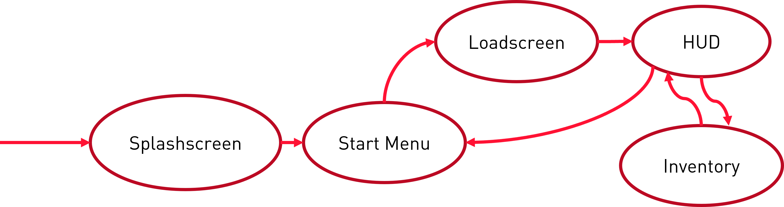

---
# UI

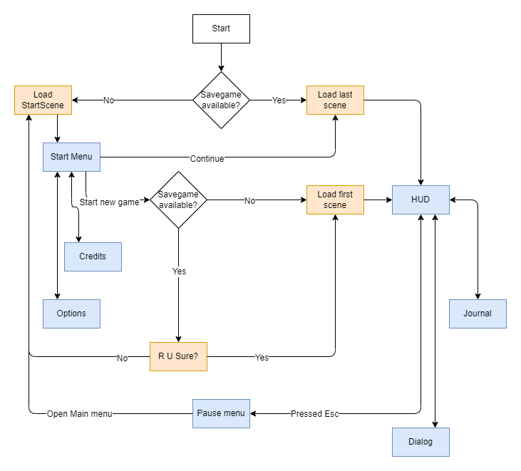

---
# UI

The user interface is an FSM with an extra dimension!

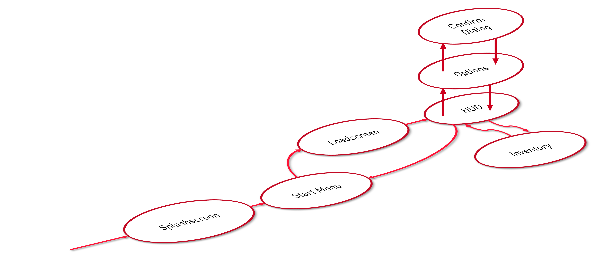

---

# Stacked states

States can be stacked. When calling a state method, it gets called on all the states in the stack.

Next the OnEnter/OnExit methods we can now also add an **OnSuspend**/**OnResume** method for each state.

For example the HUD, when suspended,
- Does not respond to input
- Is (partly) invisible
- Blurs the scene.

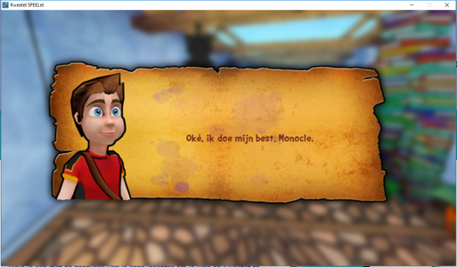

---

<!-- header: Game programming patterns - Double buffer -->

# Rendering pop quiz!

Rendering goes somewhat like this

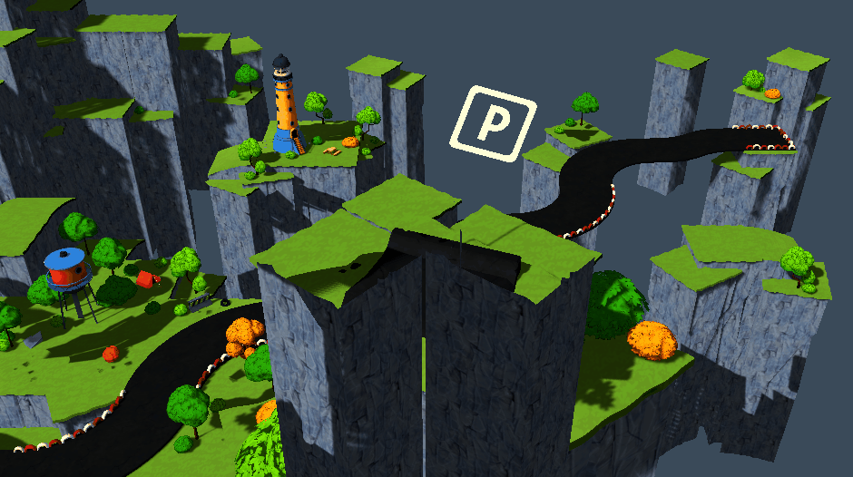

So why is it that we never get to see an image of the situation in between?

<!-- 
Correct answer: double buffering! Often called Front/Back buffer in graphics terms.
-->

---

# Rendering pop quiz!

So what is this then and how do we avoid it?

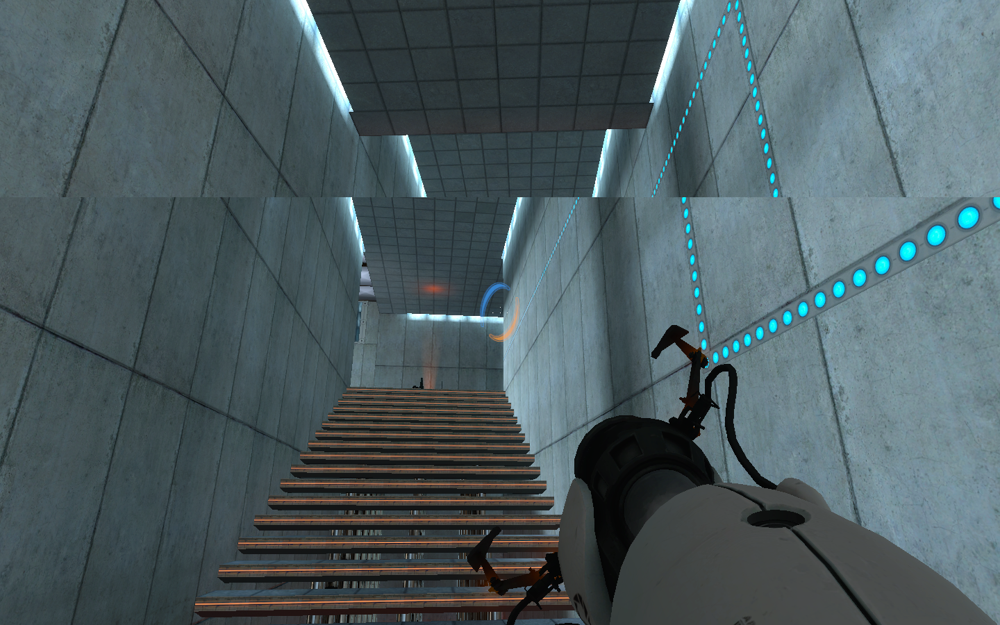

<!--
Vsync, we only switch back and front buffer when the GPU is done displaying a frame.
Introduces an extra wait in our game loop!
-->

---

# Double buffer

- When you have state that changes in steps...
- ...that may be accessed in the middle of those steps
- You want to prevent the accessing code to see the work in progress
- But you don't want to wait until its ready

Then use a double buffer.

- How much time takes the swap?
- Increased memory (double)

---

# Double buffer

This is not only applicable in rendering!

<div class="columns"><div>

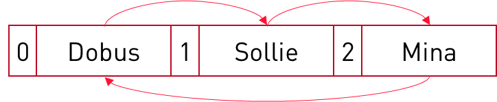

```cpp
void clown::update()
{
    if(did_i_get_slapped()) 
    {
        slap(next_clown);
    }
}
```

What happens if I slap Dobus?

</div><div>

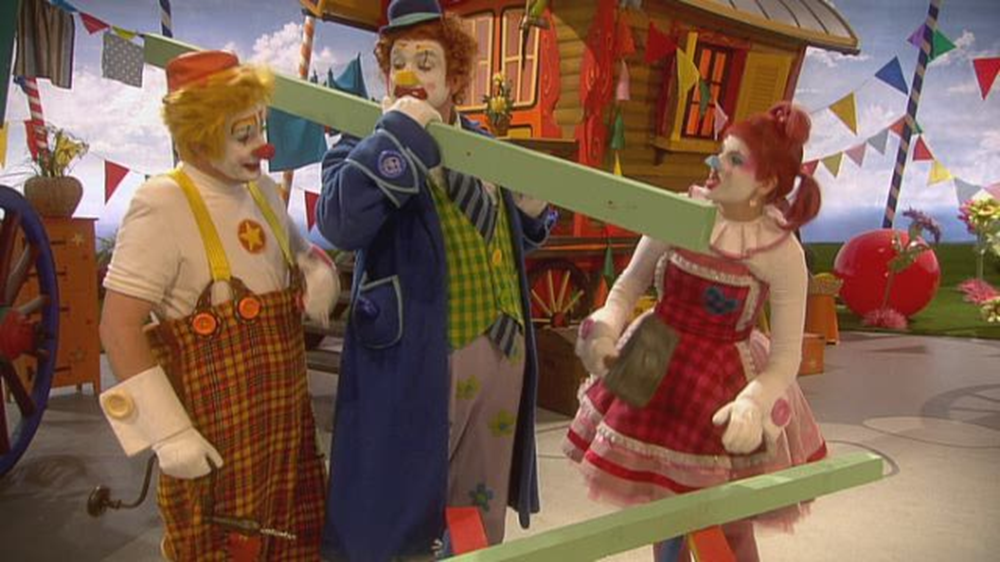

</div></div>

<!--
Say we have an array of three clowns.
They face each other according to the arrows. Given the Update method as shown, and we slap Dobus.
-->

---

# Double buffer

This is not only applicable in rendering!

<div class="columns"><div>

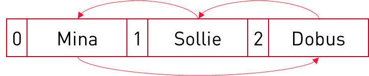

```cpp
void clown::update()
{
    if(did_i_get_slapped()) 
    {
        slap(next_clown);
    }
}
```

Now what happens if I slap Dobus?

</div><div>


</div></div>

<!--
We've switched Mina and Dobus in the array.
If we slap Dobus now, and then update our clowns, what happen now?
In the same frame, only Mina got slapped. Different behavior just by ordering the array of GameObjects different is not a desired trait.
-->

---

# Double buffer

Another example, say we implemented pacman on a grid-based system

```cpp
class ghost : public component {
  public:
    void update() {
        move_one_unit();
        if(pacman->position() - this->position().length() <= 1) {
            // code for when pacman is caught
        }
    }
}

class pacman {
  public:
    void update()
    {
        move_one_unit();
    }
}
```

Say a ghost is within two units range of pacman, what possible issue lurks here?

<!--
If Pacman is updated first, he’s fine.
If not, he gets caught.
-->

---

# Double buffer

- You could introduce double buffering.
    - Add a ```get_previous_position()``` to the ```ghost``` and ```pacman```.
- Or you could use a ``late_update``

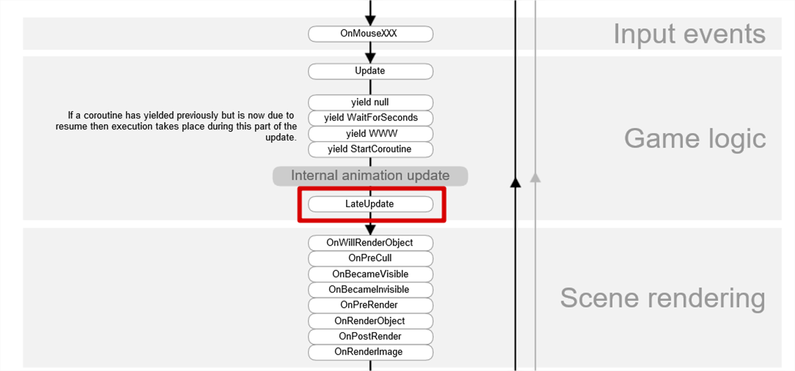

<!--
Sometimes this double buffering idea makes the code complicated and cluttered.
This is how Unity “solves” it – do positional based decision making in the LateUpdate function.
For example a follow camera should only update his position in the LateUpdate function.
Just be aware and take an appropriate approach.
-->

---

# About the swap

Swap a pointer 
- fast 
- no persistent references
-  previous data in the buffer is from two frames ago
    - Frame 1 drawn on buffer A
    - Frame 2 drawn on buffer B
    - Frame 3 drawn on buffer A
    - ...

Copy the data
- slow(er)
- previous data in the buffer is from one frame ago

---

# About the swap

- Swapping one big buffer
    - Simple to swap
- Or many objects with state that need to swap
    - Iterate over all the objects and tell them to swap
    - Clever trick: have a static "current" index and swap that one once. All objects use that index to work with their current state.

What about a double buffer to transfer state data from one thread to another?
- Swap must happen atomically
- Happens already with the backbuffer and frontbuffer (CPU/GPU)
