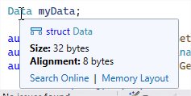
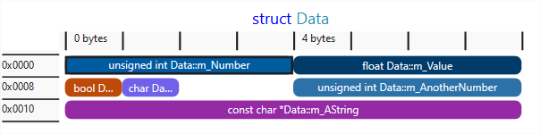
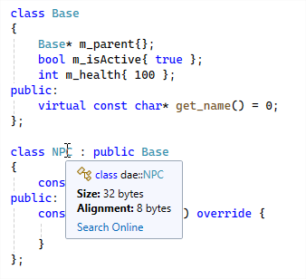
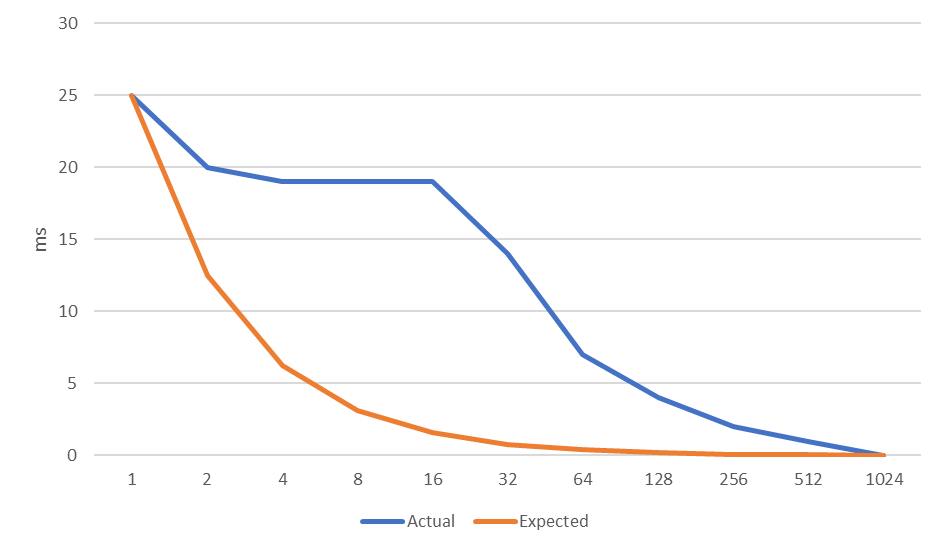
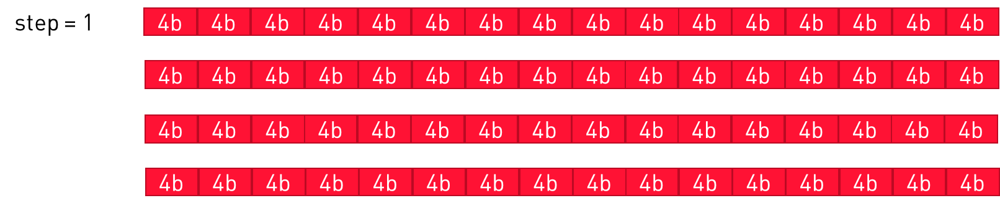
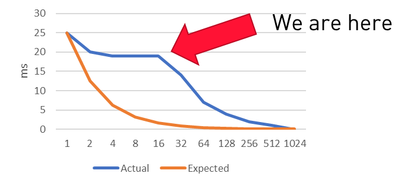
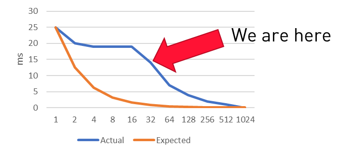
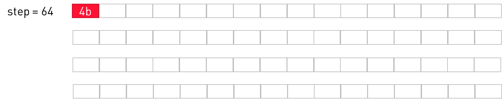

<!-- _class: title-slide-v2023 -->

# Memory

<!-- footer: Programming 4 -->

---
<!-- header: Memory types -->
<!-- paginate: true -->


# Persistent memory
- HDD
- SSD
- Network Drives
- Removable Drives

<!-- Persistent memory – memory that survives a reboot of your device.
SSD – Solid State Drive. 
HDD – Hard Disk Drives. Moving parts – slower, but more capacity (for now) 
Remember the old days when we had these things like … DVD’s?
What is the difference between an SSD and a HDD, does anyone know that? -->
---


# Persistent memory
- HDD
- SSD
- Network Drives
- Removable Drives

<!-- 
HDD’s have moving parts, with an arm seeking positions on a disk, making it slow.
SSD’s don’t have that problem and are thus way faster. 
-->
---


# Temporary memory
- RAM memory
    - Fast
---


# Temporary memory
- RAM memory
    - Fast
- CPU cache
    - L1, L2 and L3
    - Superfast!
- CPU registers
    - Fastest
---


---
<!-- header: CPU registers -->
# CPU registers

<div class="columns"><div>

Lets start at the top of that triangle

```cpp
int main()
{
  int total = 0;
  for(int i = 0; i < 10; ++i)
  {
      total += i;
  }
  return 0;
}
```

</div><div>

```
main:
  push rbp
  mov rbp, rsp
  mov DWORD PTR [rbp-4], 0
  mov DWORD PTR [rbp-8], 0
  jmp .L2
.L3:
  mov eax, DWORD PTR [rbp-8]
  add DWORD PTR [rbp-4], eax
  add DWORD PTR [rbp-8], 1
.L2:
  cmp DWORD PTR [rbp-8], 9
  jle .L3
  mov eax, 0
  pop rbp
  ret
```

</div></div>

<!--
rpb = framepointer
eax = register
-->
---
# CPU registers

So all a CPU does is
- fetch data from memory into registers
- perform some calculation (like ```add``` or ```mul```)
- store data from registers into memory

Fetching and storing from memory into registers **is slow!**

---
# CPU speed vs memory speed


<!-- source: Computer Architecture: A Quantitative Approach by John L. Hennessy, David A. Patterson, Andrea C. Arpaci-Dusseau 
How slow? Very slow. One fetch can take thousands of CPU cycles, leaving the CPU waiting idle
-->

---
<!-- header: Cache -->

# CPU cache

Because memory access is slow, we **cache** it.
- Keep local copies of main memory in the cache

The cache is faster
- More expensive memory
- Closer to the CPU

If data requested by the CPU is in the cache -> Use it!
- This is called a **cache hit**

If the data is not in the cache, fetch it from memory
- This is called a **cache miss**

--- 
# Cache lines

When we do suffer a cache miss, we must fetch

We fetch an entire “line”
- Instead of loading a single integer, load a larger chunk of memory
- Often we’ll need that extra data too, later in the program
- Resulting in more cache hits.
- "Locality of reference"


---
# CPU cache


<!--Say we have an instruction that needs to operate on a value in memory (blue) -->
---
# CPU cache

We fetch an entire "line"


<!-- We fetch the cache line containing the variable, and store the value into the CPU’s register, which can perform his instruction now. -->

---
# CPU cache

Cache miss


<!-- Say we need another value for our operation, that is located somewhere else in memory.
We need to fetch it too, and here we have a cache miss. -->

---
# CPU cache

Cache miss


<!-- Say we want to perform the same operation again but on two other values. Here we have a cache miss. -->

---
# CPU cache

Cache hit


<!-- If we locate the data we need for our operation next to each other, we have a cache hit for the second value -->

---
# CPU cache

Cache hit


<!-- Even better, the next operation can also continue without memory access -->

---
# Question

Which is better?

```cpp
struct data
{
  int some_int;
  float some_float;
};

std::vector<data*> data_objects;

std::vector<data> other_data_objects;
```

<!-- The one without the pointer :) -->

---


# Multiple levels

**Hit rate**
= how often the program hits the cache
= how often can it use data that is already in the cache

The larger the cache, the higher the hit rate

But larger caches are not that close to the CPU
- Thus slower

That’s why we have multiple levels

---
# Multiple levels

|Action|time|||
|-|-|-|-|
L1 cache reference|0.5 ns
Branch mispredict|5 ns
L2 cache reference|7 ns||14x L1 cache
Mutex lock/unlock|25 ns
Main memory reference|100 ns||20x L2 cache, 200x L1 cache
Send 1K bytes over 1 Gbps network|10,000 ns|10 μs
Read 4K randomly from SSD|150,000 ns|150 μs|~1GB/sec SSD
Read 1 MB sequentially from memory|250,000 ns|250 μs
Read 1 MB sequentially from SSD|1,000,000 ns|1,000 μs = 1 ms|4X memory
HDD Disk seek|10,000,000 ns|10,000 μs = 10 ms
Read 1 MB sequentially from HDD|20,000,000 ns|20,000 μs = 20 ms|20X SSD

---
# I-cache and D-cache

Instructions for the CPU must be fetched from memory as well
- Instruction cache : I-cache or I$

We do not want to mix those fetches with the data fetches
- Hence a separate data cache : D-cache or D$

<!-- If your code is accessing data in all separate places, you would have cache misses on the data
Or vice versa, if you jump through the code’s virtual methods that are every where in memory, you would introduce cache misses on your nice contiguous instructions. -->

<hr/>

For example, which (might) be faster?

```cpp
float v = std::powf(a, 2);

float w = a * a;
```

<!-- They’ll probably answer the 2nd, but why? Not because the algorithm might be too complex for this simple case, but because of the potential cache miss this introduces. Of course, compiler optimization will probably fix this But: no premature optimization! -->

---
# Multiple levels


---
# Cache size

Quick exercise: check yours!
- https://docs.microsoft.com/nl-nl/sysinternals/downloads/coreinfo
- (or simply google ‘coreinfo’)

---

# Cache size

This is mine (@desktop)

```
Logical Processor to Cache Map:
*---  Data Cache          0, Level 1,   32 KB, Assoc   8, LineSize  64
*---  Instruction Cache   0, Level 1,   32 KB, Assoc   8, LineSize  64
*---  Unified Cache       0, Level 2,  256 KB, Assoc   4, LineSize  64
****  Unified Cache       1, Level 3,    6 MB, Assoc  12, LineSize  64
-*--  Data Cache          1, Level 1,   32 KB, Assoc   8, LineSize  64
-*--  Instruction Cache   1, Level 1,   32 KB, Assoc   8, LineSize  64
-*--  Unified Cache       2, Level 2,  256 KB, Assoc   4, LineSize  64
--*-  Data Cache          2, Level 1,   32 KB, Assoc   8, LineSize  64
--*-  Instruction Cache   2, Level 1,   32 KB, Assoc   8, LineSize  64
--*-  Unified Cache       3, Level 2,  256 KB, Assoc   4, LineSize  64
---*  Data Cache          3, Level 1,   32 KB, Assoc   8, LineSize  64
---*  Instruction Cache   3, Level 1,   32 KB, Assoc   8, LineSize  64
---*  Unified Cache       4, Level 2,  256 KB, Assoc   4, LineSize  64
```

---
<!-- header: Object layout in memory -->
# Object layout in memory

```cpp
struct Data
{
    unsigned int m_Number{};
    float m_Value{};
    bool m_IsTest{};
    unsigned int m_AnotherNumber{ 10 };
    char m_ACharacter{ 'a' };
    const char* m_AString{ "test" };
};
```

<style scoped> code { font-size: 35px; } </style>


<!--
fd = no mans land, used by the debugger to detect buffer overruns
dd = unused free memory
cd = newly allocated memory
--->

---

# Object layout in memory

```cpp
struct Data
{
    unsigned int m_Number{};
    float m_Value{};
    unsigned int m_AnotherNumber{ 10 };
    char m_ACharacter{ 'a' };
    bool m_IsTest{};
    const char* m_AString{ "test" };
};
```

<style scoped> code { font-size: 35px; } </style>


<!--
fd = no mans land, used by the debugger to detect buffer overruns
dd = unused free memory
cd = newly allocated memory
--->


---

# Object layout in memory

```cpp
struct Data
{
    unsigned int m_Number{};
    float m_Value{};
    unsigned int m_AnotherNumber{ 10 };
    char m_ACharacter{ 'a' };
    bool m_IsTest{};
    const char* m_AString{ "test" };
};
```

What about these fd's?

<style scoped> code { font-size: 35px; } </style>


<!--
fd = no mans land, used by the debugger to detect buffer overruns
dd = unused free memory
cd = newly allocated memory
--->

---
# Memory alignment

Every data type has a natural alignment
- 1-byte aligned objects reside at any address
  - bool and char
- 2-byte aligned objects reside at addresses which end in 0x0, 0x2, 0x4… 0xE
- 4-byte aligned objects reside at addresses which end in 0x0, 0x4, 0x8 or 0xC
  - integer, float and pointer
- 8-byte aligned objects reside at addresses which end in 0x0 or 0x8
  - double
- 16-byte aligned objects reside at addresses which end in 0x0
  - SIMD vector

---
# Memory alignment

Why? We would have to shift and OR the bits if not aligned:


---
# Memory alignment

<div class="columns"><div>

The alignment of our struct (x86)?
- 4-byte – the largest alignment of its members.

Classes that inherit from another class
- Just add their members to the base class
- But with padding in between
- If there are any virtual functions: adds a pointer to the vtable

</div><div>

```cpp
struct Data
{
    unsigned int m_Number{};
    float m_Value{};
    unsigned int m_AnotherNumber{ 10 };
    char m_ACharacter{ 'a' };
    bool m_IsTest{};
    const char* m_AString{ "test" };
};
```

</div></div>

---

# Memory alignment

Feature since Visual Studio 17.9:



8 Byte alignment?




---
# Memory alignment

What about these?

```cpp
class Base
{
    Base* m_parent{};
    bool m_isActive{true};
    int m_health{100};
  public:
    virtual const char* get_name() = 0;
};

class NPC : public Base
{
    const char* m_name{};
  public:
    const char* get_name() override {
        return m_name; 
      }
};
```
What will sizeof(NPC) return? What is the alignment?

<!-- 32b in x64, 20b in x86 -->

---
# Memory alignment

<div class="columns"><div>

What about these?

```cpp
class Base
{
    Base* m_parent{};
    bool m_isActive{true};
    int m_health{100};
  public:
    virtual const char* get_name() = 0;
};

class NPC : public Base
{
    const char* m_name{};
  public:
    const char* get_name() override {
        return m_name; 
      }
};
```

</div><div>



</div><div>


---

x86

```cpp
class Base
{
    Base* m_parent{};
    bool m_isActive{true};
    int m_health{100};
  public:
    virtual const char* get_name() = 0;
};

class NPC : public Base
{
    const char* m_name{};
  public:
    const char* get_name() override {
        return m_name; 
      }
};
```


<!-- 32b in x64, 20b in x86
Red – the canaries
Yellow – The vtable pointer
Green – m_parent
Blue – m_isActive + padding
Purple – m_health
Orange – m_name
-->

---

x64

```cpp
class Base
{
    Base* m_parent{};
    bool m_isActive{true};
    int m_health{100};
  public:
    virtual const char* get_name() = 0;
};

class NPC : public Base
{
    const char* m_name{};
  public:
    const char* get_name() override {
        return m_name; 
      }
};
```


<!-- 32b in x64, 20b in x86
Red – the canaries
Yellow – The vtable pointer
Green – m_parent
Blue – m_isActive + padding
Purple – m_health
Orange – m_name
-->

---

# Cache alignment

Consider this example:
```cpp
char a[10];
char b[10];

start_thread_that_works_on_a;
start_thread_that_works_on_b;
```
Odds are that a and b will be contiguous in memory and fit in the same cache line.
- Both threads will invalidate each others cache line
- This is called “False sharing”

Solution: align the data to the cache line size,
Processes and threads can be designated to a specific core
- Windows: ```SetProcessAffinityMask``` and ```SetThreadAffinityMask```

To make sure the threads stay away from each others cache
- They’ll meet again in the Level 2 cache though.

---
<!-- header: Thrashing the cache -->
# Exercise

1. Allocate a **very large buffer** of integers **on the heap**.
2. Iterate over it with stepsize = 1, doubling the value each time
```cpp
for(stepsize = 1; stepsize <= 1024; stepsize *= 2)
{
  for (int i = 0; i < arr.length; i += stepsize) 
  {
    arr[i] *= 2;
  }
}
```
3. Measure the time it takes.
4. Repeat 2-3 with stepsize = 2, 4, 8, 16, 32, 64, 128, 256, 512, 1024
5. Take timinigs, in release mode, and put them in a graph
Ideally, we would expect a graph that looks like the one on the right.


---

# Exercise

Take good timings!
- Measure in Release mode
- Take multiple samples per stepsize (10+)
- Remove the highest and the lowest value
- Take the average
- That is your timing for that stepsize

Use ```std::chrono``` for this (as you've been taught in Prog 3)

```cpp
auto start = high_resolution_clock::now();

// do whatever you need to

auto end = high_resolution_clock::now();
auto elapsedTime = duration_cast<microseconds>(end - start).count();
cout << "operation took " << elapsedTime / 1000.f << "ms" << endl;
```

---

# Exercise

The blue line is the graph for my pc @ home:



What happened?

---

# Exercise

The blue line is the graph for my pc @ home:


What happened?

- An int takes 4 bytes - 
- A step of 16 x 4 jumps 64 bytes - we need every cache line
- A step of 32 x 4 jumps 128 bytes - we need every other cache line

---

# What happened?




---

# What happened?


---

# What happened?




---

# What happened?


This time we finally skip 50% of the cachelines!



---

# What happened




---
<!-- header: Avoid cache misses -->

<div class="columns"><div>

# 2 Types of cache

## I-cache

- Keep high performance code as small as possible
- Avoid calling functions within performance-critical sections of your code
  - Certainly when virtual functions are involved, we need to pass via the vtable then.
- If you must call functions, think where you put them
  - A function’s body is contiguous in memory
  - Functions appear in the same order as they are defined in the .cpp
  - Thus: all code in one .cpp is contiguous
- Use inlining

</div><div>

## D-cache

- Organize data in contiguous blocks 
- As small as possible
- Access them sequentially

- Data Oriented Programming
  - Component pattern
  - Object Pool pattern

</div></div>

---

<!-- header: Data oriented design -->

# Examples

Imagine we have a ```particle``` class

```cpp
class particle
{
    float remaining_duration;
    vec3f pos;
    vec3f velocity;
  public:
    particle() = default;
    void init(vec3f position, vec3f velocity, float duration);
    bool update(float delta_time); // move around, grow/shrink, etc...
    bool is_alive() const;
};
```

Used by a ```particle_system```

```cpp
void particle_system::update(float delta_time) 
{
  for(auto& particle : m_particles) 
  {
    particle.update(delta_time)
  }
}
```

---

# Examples

But not all particles are active at the same time, so:

```cpp
void particle_system::update(float delta_time) 
{
  for(auto& particle : m_particles) 
  {
    if(particle.is_active())
      particle.update(delta_time)
  }
}
```

<!-- Not all particles are active at the same time, so we check. Introduces a lot of cache fetches that are often not needed

How do we fix? - Open question, many solutions possible…

One: keep active particles together in memory by swapping their data around and keeping track of how many active particles there are. Can't do this with pointer swapping, so potentially this moves a lot of memory around.
Is a tradeoff, what is cheaper for the use case you have? MEASURE before optimize.
-->

---

# Examples

<div class="columns"><div>

How can this be improved?

</div><div>

```cpp
class animation;

enum class loot_type {
  gold,
  silver,
  chicken
};

class npc : public component {
  animation* m_current;
  vec3f m_goal;
  loot_type m_drop;
  int m_min_drops;
  int m_max_drops;

public:
  void update() {
    // walk towards goal, play anims, etc.
  }
}
```
</div></div>

<!--
Problem: AIComponent has a lot of data. Can't fit all of it or too few in a cache line. 
Open question: how do we fix that
Solution: we split the data into hot/cold. Only data in the hot path should reside in the AIComponent and be used in the update function. The cold data we separate into another object and we just point to it.
-->

---

# Examples

<div class="columns"><div>

We split the data according to whether it's used in the **hot or cold path**.

- *Hot path*: data we need every frame / code we run every frame
  - Most often the code called in the Update method
- *Cold path*: data we need once in a while / code that runs now and then
  - for example when a loot drop even happens

</div><div>

```cpp
class animation;

enum class loot_type {
  gold,
  silver,
  chicken
};

struct loot_drop {
  loot_type m_drop;
  int m_min_drops;
  int m_max_drops;
}

class npc : public component {
  animation* m_current;
  vec3f m_goal;
  lootdrop* m_loot;
 
public:
  void update() {
    // walk towards goal, play anims, etc.
  }
}
```

</div></div>

---

# Exercise

Do the same exercise as before, but now with this class instead of integers:

```cpp
struct transform 
{
  float matrix[16] = {
    1,0,0,0,
    0,1,0,0,
    0,0,1,0,
    0,0,0,1
  };
};

class gameobject
{
  transform local;
  int id;
}
```

What does de graph look like now? Why? How do you fix it?

---

# Exercise

Our graph now looks like this:


What’s wrong with it?
Why? How do we fix it?

<!-- 
We access every cacheline for every step, causing the timing to match the expected result. But what we don't want is the height of the graph.

Let students fix it according to AIComponent example
-->

---

# Exercise

With this alternative:

```cpp
class gameobject
{
  transform* local;
  int id;
}
```

We get these results:

<div class="columns"><div>


</div><div>


</div></div>

<!--
Again, we flatline until k = 8 (because sizeof(GameObject3DAlt) = 8 instead of 4 as in the previous example)

But compare it with the GameObject3D and you see the massive gain, until k = 16 - then we're in the same boat again.
-->

---

<!-- header: UI -->

# User interface programming

There are mainly two types of UI

<div class="columns"><div>

## Retained mode (RMGUI)
- Useful for static applications
- Interrupt based
- Construct everything upfront and call “run”
- Matches the MVC pattern -> .Net WinForms
- Matches the MVVM pattern -> XAML, UXML

</div><div>

## Immediate mode (IMGUI)

- Heavy on the CPU/GPU
- Gets re-constructed every frame
- Useful for real-time applications
- Unity Editor (deprecated though)

</div></div>

---

# Dear ImGui

Is a popular immediate mode GUI library, often used in game engines.


<sub>Rainbow Six, Ubisoft. https://github.com/ocornut/imgui/wiki/software-using-dear-imgui</sub>

---

# Dear ImGui

Is a popular immediate mode GUI library, often used in game engines.

Check out this (very) short overview:

https://www.youtube.com/watch?v=LSRJ1jZq90k

Let’s set this up! Check out the Dear ImGui assignment on Leho

---

# Exercise

Using the results of the previous exercise, instead of writing the timings to cout, plot them in a graph.


Hint: https://github.com/soulthreads/imgui-plot
